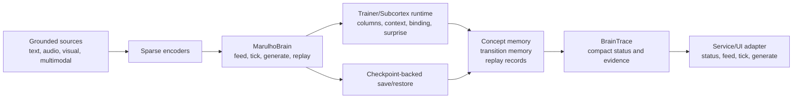
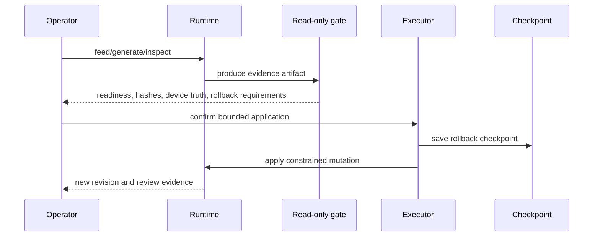

# MARULHO

MARULHO is an experimental spiking cognitive runtime for grounded, auditable autonomous behavior.

The name comes from Brazilian Portuguese: marulho is the constant wave-like movement of water and the soft sound produced by that motion. That is the project metaphor: cognition as a continuous flow of sparse signals, prediction errors, memory traces, replay, and local plasticity rather than a hidden text generator.

MARULHO is not presented as a biological brain, an AGI system, or a production safety boundary. It is a research codebase for building and inspecting a local SNN-native substrate where language-facing output must be grounded in runtime evidence.

## Goal

The project goal is to grow a local, observable cognitive substrate that can:

- encode text, visual, audio, and multimodal observations into sparse runtime evidence;
- route evidence through competitive columns, context, binding, abstraction, surprise, and memory layers;
- expose compact `BrainTrace` telemetry instead of hiding capability claims behind fluent text;
- generate early SNN-native language readout through local sparse transition state, replay, and plasticity evidence;
- keep mutation paths checkpoint-backed, operator-reviewable, and rollback-aware.

The current direction intentionally avoids an external LLM or mock "thought loop" as the cognition substrate. External SNN and neuromorphic papers can inform design, but runtime behavior should be owned by MARULHO code, MARULHO checkpoints, and MARULHO evidence ledgers.

## Current Spine

`MarulhoBrain` is the main runtime entry point. The intended hot path is:

```python
brain = MarulhoBrain.load(checkpoint_path)
brain.feed(text_or_source)
trace = brain.tick(tokens=128)
sample = brain.generate(prompt=None, max_tokens=64)
brain.replay(window="recent_surprise")
brain.grow_prune(budget="small")
brain.save(checkpoint_path)
```

The service and UI are adapters over that spine. CUDA/Triton/native graph execution stays in `MarulhoTrainer`; checkpoint serialization stays in `marulho.training.checkpointing`; the brain layer owns source buffering, tick orchestration, local readout, replay/growth hooks, compact trace telemetry, and checkpoint metadata continuity.

## Architecture



The Python package is `marulho`. `MarulhoBrain` is the runtime spine; `MarulhoBrainServiceManager` is the active service adapter for `/brain/*`. New runtime work should target `src/marulho/brain` first and expose only thin service/UI projections.

Key areas:

- `src/marulho/core`: local SNN mechanisms such as columns, binding, context, topography, plasticity, sparsity, and surprise.
- `src/marulho/data`: source loaders and encoders for text, semantic features, event camera style input, audio, and multimodal streams.
- `src/marulho/semantics`: grounded language/readout contracts, cognitive signal surfaces, decoder probes, and concept evidence.
- `src/marulho/service`: thin FastAPI adapter over `MarulhoBrain`; old service-owned route families are retired from the active app.
- `src/marulho/brain`: the main runtime spine, compact trace, local generation/readout, source buffer, replay/growth hooks, and checkpoint metadata continuity.
- `src/marulho/training`: bootstrap, developmental, autonomy, consolidation, query, and long-run evaluation runners.
- `src/marulho/evaluation`: promotion gates, benchmarks, readiness checks, and validation harnesses.
- `MARULHO_UI`: the control-room UI submodule.

## Evidence Gates

MARULHO separates observation, review, and mutation. Read-only gates can measure readiness, support, sparsity, device placement, and rollback evidence. Executor paths are narrower: they require current runtime revision checks, explicit confirmation, checkpoint transactions, and bounded deltas.



This keeps public claims narrow. A readable label, draft, or rollout is not automatically a thought, fact, action, or proof of cognition. Promotion requires explicit evidence.

## Public Status

This repository is public for research and engineering review.

Current strengths:

- broad test coverage over runtime gates and service behavior;
- explicit domain language in `CONTEXT.md`;
- package-local machinery docs in `src/marulho/*/README.md`;
- local runtime and UI surfaces for inspecting evidence.

Known limitations:

- the project is experimental and changes quickly;
- many language/readout paths are intentionally bounded or read-only;
- generated reports and checkpoints are local artifacts, not part of the public source tree;
- CUDA/GPU claims should be treated as valid only when supported by observed runtime evidence.

Current refactor validation note, 2026-06-30: the brain spine compile/test/UI
checks pass, and the active service loads `MarulhoBrainServiceManager` without
importing the legacy manager/status/control modules. A short promoted-checkpoint
stress smoke completed through the CUDA conditional-WHILE backend with zero
graph/native failures. Two short sequence-input staging smokes failed their
speedup comparison, but the longer default 64-sequence gate passed with
`5632.644` sequence tokens/sec versus `4878.951` per-quantum tokens/sec
(`1.154x`) on the same conditional-WHILE backend with zero graph/native
failures.

## Setup

Requirements:

- Python 3.10+
- Node.js for the UI
- PyTorch-compatible CPU or CUDA environment

Install the Python package in editable mode:

```bash
python -m venv .venv
.\.venv\Scripts\activate
pip install -e .[dev]
```

Run tests:

```bash
pytest
```

Build or run the UI:

```bash
cd MARULHO_UI
npm install
npm run dev
```

Launch the local FastAPI service with an existing checkpoint:

```bash
python -m marulho.service.server --checkpoint checkpoints/terminus/model.pt --port 8000
```

The maintained HTTP contract is `/brain/*` for status, status stream, feed, tick, generate, replay, grow/prune, and checkpoint actions. Legacy root-level and `/terminus/*` route families are retired from the active API.

For a clean public checkout, generate checkpoints locally before launching the service. Runtime checkpoints and validation reports are intentionally ignored by git.

## Documentation Map

- `CONTEXT.md`: project vocabulary and current domain model.
- `src/marulho/README.md`: package-level machinery map.
- `src/marulho/*/README.md`: local ownership rules, hot-path boundaries, and evidence notes for each machinery folder.
- `tests`: executable behavior expectations.

The former vault, Graphify outputs, goals folder, ADR docs, research monolith,
and Terminus tutorial are retired from the maintained documentation surface.

## Repository Hygiene

The public source tree excludes generated runtime reports and model checkpoints. Local runs may recreate:

- `reports/`
- `checkpoints/`

Those directories are ignored by git and should be treated as disposable run artifacts unless a specific result is intentionally promoted into documentation.

## License

No open-source license has been selected yet. Until a license is added, the public repository is available for inspection but does not grant reuse rights beyond GitHub's default terms.
