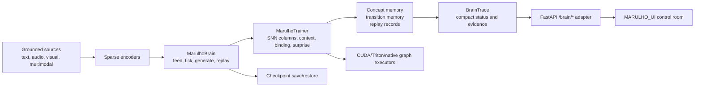

# MARULHO

MARULHO is an experimental spiking cognitive runtime for grounded, auditable autonomous behavior.

The name comes from Brazilian Portuguese: marulho is the constant wave-like movement of water and the soft sound produced by that motion. The project uses that metaphor for cognition as a continuous flow of sparse signals, prediction errors, memory traces, replay, and local plasticity.

MARULHO is not presented as a biological brain, an AGI system, or a production safety boundary. It is a research codebase for building and inspecting a local SNN-native substrate where language-facing output must be grounded in runtime evidence.

## Runtime Shape

`MarulhoBrain` is the main runtime entry point. The maintained loop is:

1. Load or restore a checkpoint.
2. Feed text or another local source.
3. Tick the trainer and learn from the source window.
4. Generate a bounded local readout from sparse runtime state.
5. Run explicit replay windows.
6. Review growth/pruning hooks under checkpoint-backed boundaries.
7. Emit compact `BrainTrace` telemetry.
8. Save or restore runtime state.

Minimal Python shape:

```python
from marulho.brain import MarulhoBrain

brain = MarulhoBrain.load("checkpoints/marulho/model.pt")
brain.feed("local source text")
trace = brain.tick(tokens=128)
sample = brain.generate(max_tokens=64)
brain.replay(window="recent_surprise")
brain.grow_prune(budget="small")
brain.save("checkpoints/marulho/model.pt")
```

The project does not use a hidden external LLM, Cortex loop, or ThoughtLoop as the brain. External research can inform design, but runtime behavior should be owned by MARULHO code, MARULHO checkpoints, and MARULHO evidence.

## Architecture



Key machinery:

- `src/marulho/brain`: `MarulhoBrain`, `BrainTrace`, source buffering, tick orchestration, local generation/readout, replay/growth hooks, and checkpoint metadata continuity.
- `src/marulho/training`: trainer execution, checkpoint serialization, CUDA/Triton/native graph lifecycle, sequence execution, replay hooks, and long-run runners.
- `src/marulho/core`: local SNN mechanisms such as competitive columns, predictive state, binding, context, topography, plasticity, sparsity, and surprise.
- `src/marulho/data`: source loaders and sparse encoders for text, semantic features, event-camera style input, audio, and multimodal streams.
- `src/marulho/semantics`: grounded readout contracts, concept evidence, cognitive signal surfaces, decoder probes, and support diagnostics.
- `src/marulho/consolidation`: CPU archival memory, replay records, and consolidation metadata.
- `src/marulho/retrieval`: tensor candidate search, routing caches, and graph-safe cache generation.
- `src/marulho/service`: thin FastAPI adapter over `MarulhoBrain`.
- `src/marulho/evaluation`: benchmarks, promotion gates, readiness checks, and validation harnesses.
- `MARULHO_UI`: the control-room UI.

## HTTP And UI

The maintained service surface is intentionally small:

- `GET /health`
- `GET /`
- `/brain/*` for status, status stream, start, stop, feed, tick, generate, replay, grow/prune, traces, and checkpoint actions

The service should adapt `MarulhoBrain`; it should not own neural algorithms, scheduler policy, CUDA execution, replay selection, or hidden mutation work. The UI should call the `/brain/*` contract and render compact traces plus explicit evidence.

## Evidence And Checkpoints

MARULHO separates observation, review, and mutation. Readout text, labels, rollout candidates, benchmark reports, and traces are evidence for review. They are not automatically facts, actions, or proof of cognition.

Mutation paths should be:

- checkpoint-backed;
- bounded by explicit runtime revision and rollback evidence;
- operator-reviewable when they affect durable state;
- measurable through tests, traces, or benchmark artifacts.

CUDA claims require observed backend/device/failure-counter evidence, not configured intent.

## Current Validation

Latest local validation snapshot, 2026-06-30 on a RTX3060:

- `python -m compileall -q src tests`: passed.
- `python -m pytest`: `1625 passed`, `1 warning`.
- `npm run build` in `MARULHO_UI`: passed.
- Long sequence-input CUDA gate: `6601.19` sequence tokens/sec versus `6507.41` per-quantum tokens/sec, backend `cuda_graph_conditional_while`, execution mode `cuda_graph_route_transition_burst`, device `cuda:0`, zero graph/native/burst failures.
- Continuous stress: `256`, `1024`, and `4096` token runs passed through the same conditional-WHILE CUDA backend with zero graph/native/burst failures. The `4096` token run reached `121.93` tokens/sec over `32` ticks.

Known current validation gap: the `8192` and `131072` token continuous stress attempts did not produce a final JSON report before manual stop. Treat the long continuous stress boundary as open until that runner is diagnosed.

## Setup

Requirements:

- Python 3.10+
- Node.js for the UI
- PyTorch-compatible CPU or CUDA environment

Install the Python package in editable mode:

```bash
python -m venv .venv
.\.venv\Scripts\activate
pip install -e .[dev]
```

Run tests:

```bash
pytest
```

Build or run the UI:

```bash
cd MARULHO_UI
npm install
npm run dev
```

Launch the local FastAPI service with an existing checkpoint:

```bash
python -m marulho.service.server --checkpoint checkpoints/marulho/model.pt --port 8000
```

For a clean checkout, generate checkpoints locally before launching the service. Runtime checkpoints and validation reports are local artifacts.

## Documentation

The maintained documentation set is small:

- `CONTEXT.md`: project vocabulary and domain model.
- `src/marulho/README.md`: package-level machinery map.
- `src/marulho/*/README.md`: local ownership rules, hot-path boundaries, and evidence notes for each machinery folder.
- `tests`: executable behavior expectations.

Update the closest README when machinery ownership changes. Update `CONTEXT.md` when vocabulary or domain rules change.

## Repository Hygiene

The public source tree excludes generated runtime reports and model checkpoints. Local runs may recreate:

- `reports/`
- `checkpoints/`

Those directories are ignored by git and should be treated as disposable run artifacts unless a specific result is intentionally promoted into documentation.

## License

No open-source license has been selected yet. Until a license is added, the public repository is available for inspection but does not grant reuse rights beyond GitHub's default terms.
