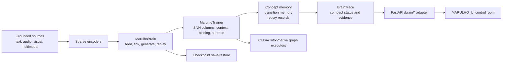

# MARULHO

MARULHO is an experimental spiking cognitive runtime for grounded, auditable autonomous behavior.

The name comes from Brazilian Portuguese: marulho is the constant wave-like movement of water and the soft sound produced by that motion. The project uses that metaphor for cognition as a continuous flow of sparse signals, prediction errors, memory traces, replay, and local plasticity.

MARULHO is not presented as a biological brain, an AGI system, or a production safety boundary. It is a research codebase for building and inspecting a local SNN-native substrate where language-facing output must be grounded in runtime evidence.

## Runtime Shape

`MarulhoBrain` is the main runtime entry point. The maintained loop is:

1. Load or restore a checkpoint.
2. Feed text or another local source.
3. Tick the trainer and learn from the source window.
4. Generate a bounded local readout from sparse runtime state.
5. Run explicit replay windows.
6. Review growth/pruning hooks under checkpoint-backed boundaries.
7. Emit compact `BrainTrace` telemetry.
8. Save or restore runtime state.

Minimal Python shape:

```python
from marulho.brain import MarulhoBrain

brain = MarulhoBrain.load("checkpoints/marulho/model.pt")
brain.feed("local source text")
trace = brain.tick(tokens=128)
sample = brain.generate(max_tokens=64)
brain.replay(window="recent_surprise")
brain.grow_prune(budget="small")
brain.save("checkpoints/marulho/model.pt")
```

The project does not use a hidden external LLM, Cortex loop, or ThoughtLoop as the brain. External research can inform design, but runtime behavior should be owned by MARULHO code, MARULHO checkpoints, and MARULHO evidence.

## Architecture



Key machinery:

- `src/marulho/brain`: `MarulhoBrain`, `BrainTrace`, source buffering, tick orchestration, local generation/readout, replay/growth hooks, and checkpoint metadata continuity.
- `src/marulho/training`: trainer execution, checkpoint serialization, CUDA/Triton/native graph lifecycle, sequence execution, replay hooks, and long-run runners.
- `src/marulho/core`: local SNN mechanisms such as competitive columns, predictive state, binding, context, topography, plasticity, sparsity, and surprise.
- `src/marulho/data`: source loaders and sparse encoders for text, semantic features, event-camera style input, audio, and multimodal streams.
- `src/marulho/semantics`: grounded readout contracts, concept evidence, cognitive signal surfaces, decoder probes, and support diagnostics.
- `src/marulho/consolidation`: CPU archival memory, replay records, and consolidation metadata.
- `src/marulho/retrieval`: tensor candidate search, routing caches, and graph-safe cache generation.
- `src/marulho/service`: thin FastAPI adapter over `MarulhoBrain`.
- `src/marulho/evaluation`: benchmarks, promotion gates, scale-ladder inventories, readiness checks, and validation harnesses.
- `MARULHO_UI`: the control-room UI.

## HTTP And UI

The maintained service surface is intentionally small:

- `GET /health`
- `GET /`
- `/brain/*` for status, status stream, start, stop, feed, tick, generate, replay, grow/prune, traces, and checkpoint actions

The service should adapt `MarulhoBrain`; it should not own neural algorithms, scheduler policy, CUDA execution, replay selection, or hidden mutation work. The UI should call the `/brain/*` contract and render compact traces plus explicit evidence.

## Evidence And Checkpoints

MARULHO separates observation, review, and mutation. Readout text, labels, rollout candidates, benchmark reports, and traces are evidence for review. They are not automatically facts, actions, or proof of cognition.

Mutation paths should be:

- checkpoint-backed;
- bounded by explicit runtime revision and rollback evidence;
- operator-reviewable when they affect durable state;
- measurable through tests, traces, or benchmark artifacts.

CUDA claims require observed backend/device/failure-counter evidence, not configured intent.

## Current Validation

The current base-language branch is the MARULHO-owned causal Transformer with a
checkpoint-owned BPE vocabulary. The 2026-07-10 matched BPE CUDA pilot
`reports/language_architecture_bakeoff/nvidia-open-bpe-transformer-pilot-20260710.json`
retired the recurrent language base: at `4194304` update tokens the
`5249280`-parameter Transformer reached heldout loss `6.0762` at `38269.498`
tokens/sec, versus the `3812352`-parameter dense GRU at loss `6.6979` and
`18590.293` tokens/sec. Diverse unseen generation remains `0/4`, but the
Transformer produces partially grammatical multi-sentence code/reasoning
fragments where the GRU still collapses. This is an architecture branch, not a
generation-quality promotion. Recurrent/SNN language routing is being removed;
continual memory and plasticity remain paused until a Transformer checkpoint
demonstrates coherent unseen language.

Latest local validation snapshot, 2026-07-03 on a RTX3060:

- `python -m compileall -q src tests`: passed.
- `python -m pytest`: `1632 passed`, `17 subtests passed`, `1 warning`.
- Focused encoder/brain/stress-runner tests: `43 passed`.
- `npm run build` in `MARULHO_UI`: passed.
- Continuous runtime diagnostic: `reports/runtime_evidence_20260703/diagnostic-8192-after-feed-readout-fix.json` reached `8192/8192` tokens, `3120.356 tokens/sec`, mean tick `21.123 ms`, p95 `19.287 ms`, CUDA `NVIDIA GeForce RTX 3060`, `conditional_while`, zero CUDA graph/native/sequence failures. GPU contention was observed in this diagnostic run.
- Continuous runtime long gate: `reports/runtime_evidence_20260703/long-gate-131072-after-feed-readout-fix.json` reached `131072/131072` tokens, `5608.147 tokens/sec`, mean tick `17.800 ms`, p95 `20.073 ms`, CUDA `NVIDIA GeForce RTX 3060`, `conditional_while`, zero CUDA graph/native/sequence failures or fallbacks, route rows bounded at `12/65536`, state transition all-column execution `false`, source refill `brain_feed_streaming_refill`, `16` feed calls, zero source drops, contention `not_observed`.
- Continuous runtime house-scale gate: `reports/runtime_evidence_20260703/house-scale-524288-after-feed-readout-fix.json` reached `524288/524288` tokens, `5877.601 tokens/sec`, mean tick `17.445 ms`, p95 `19.358 ms`, CUDA `NVIDIA GeForce RTX 3060`, `conditional_while`, zero CUDA graph/native/sequence failures or fallbacks, route rows bounded at `12/65536`, state transition all-column execution `false`, source refill `brain_feed_streaming_refill`, `64` feed calls, zero source drops, contention `not_observed`.
- Rejected regression evidence: same-day unqualified `diagnostic-8192.json`, `long-gate-131072.json`, and `house-scale-524288.json` captured a wrapper regression where `MarulhoBrain.feed(..., learn=False)` still learned chunks and tick readout keys recomputed offline winners per token. They are retained only as regression evidence, not current runtime speed evidence.
- Preserved failure evidence: `reports/runtime_evidence_20260703/long-gate-131072-source-exhausted-before-refill.json` shows the old one-shot feed path exhausted the bounded `8192`-token source buffer after `8192` tokens. The runner now refills the brain-owned source buffer in bounded chunks.
- Continuous stress smoke/debug history: `256`, `1024`, and `4096` token runs passed through the same conditional-WHILE CUDA backend with zero graph/native/burst failures. These short runs are not promotion evidence.

The maintained promotion surface is sustained MARULHO runtime evidence. Use `8192` tokens as the first diagnostic boundary, `131072` tokens as the normal long-run gate, and `524288` tokens as the house-scale target when hardware/runtime budget allows. Promotion is not allowed from `256`, `1024`, or `4096` token runs.

Continuous stress commands:

```bash
python -m marulho.evaluation.continuous_runtime_stress_benchmark --checkpoint checkpoints/marulho/model.pt --output reports/runtime_evidence_20260703/diagnostic-8192.json --target-tokens 8192 --tick-tokens 128 --quantum-tokens 16 --timeout-seconds 600 --sample-interval-seconds 0.001
python -m marulho.evaluation.continuous_runtime_stress_benchmark --checkpoint checkpoints/marulho/model.pt --output reports/runtime_evidence_20260703/long-gate-131072.json --target-tokens 131072 --tick-tokens 128 --quantum-tokens 16 --timeout-seconds 7200 --sample-interval-seconds 0.001
python -m marulho.evaluation.continuous_runtime_stress_benchmark --checkpoint checkpoints/marulho/model.pt --output reports/runtime_evidence_20260703/house-scale-524288.json --target-tokens 524288 --tick-tokens 128 --quantum-tokens 16 --timeout-seconds 21600 --sample-interval-seconds 0.001
```

Current boundary: final fixed `131072` and `524288` token reports exist, so the normal long-run and house-scale evidence artifact boundaries are closed for this milestone while preserving the historical 6k-ish hot-path band.

## Setup

Requirements:

- Python 3.10+
- Node.js for the UI
- PyTorch-compatible CPU or CUDA environment

Install the Python package in editable mode:

```bash
python -m venv .venv
.\.venv\Scripts\activate
pip install -e .[dev]
```

For CUDA/Triton/native-graph validation on Windows, install the CUDA extra in
the same environment:

```bash
pip install -e .[cuda]
```

Native parent CUDA graph promotion also requires a PyTorch build that exposes
`torch.cuda.CUDAGraph.raw_cuda_graph()`. When that raw child-graph handle is not
available, MARULHO reports
`torch_cudagraph_raw_handle_unavailable` and must not promote conditional native
sequence executor claims from fallback execution. In that environment, full
sequence quanta may still use the separately reported `torch_sequence_graph_*`
executor, which is CUDA graph evidence but not native conditional-WHILE evidence.

Run tests:

```bash
pytest
```

Build or run the UI:

```bash
cd MARULHO_UI
npm install
npm run dev
```

Launch the local FastAPI service with an existing checkpoint:

```bash
python -m marulho.service.server --checkpoint checkpoints/marulho/model.pt --port 8000
```

For a clean checkout, generate checkpoints locally before launching the service. Runtime checkpoints and validation reports are local artifacts.

## Documentation

The maintained documentation set is small:

- `CONTEXT.md`: project vocabulary and domain model.
- `docs/autonomous-continual-language-runtime.md`: architecture lock for the MARULHO-owned continual language model target. This is design guidance, not implementation evidence.
- `src/marulho/README.md`: package-level machinery map.
- `src/marulho/*/README.md`: local ownership rules, hot-path boundaries, and evidence notes for each machinery folder.
- `tests`: executable behavior expectations.

Update the closest README when machinery ownership changes. Update `CONTEXT.md` when vocabulary or domain rules change.

## Repository Hygiene

The public source tree excludes generated runtime reports and model checkpoints. Local runs may recreate:

- `reports/`
- `checkpoints/`

Those directories are ignored by git and should be treated as disposable run artifacts unless a specific result is intentionally promoted into documentation.

## License

No open-source license has been selected yet. Until a license is added, the public repository is available for inspection but does not grant reuse rights beyond GitHub's default terms.
