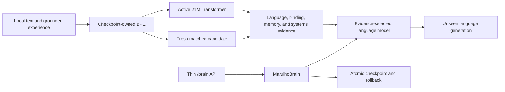

# MARULHO

MARULHO is a local research project for building a continual language system
whose model, tokenizer, memory, learning rules, checkpoints, and evaluation are
owned by MARULHO.

MARULHO is not currently an AGI or a frontier language model. It is an
experimental system running on a single RTX 3060, with a deliberately aggressive
research policy: matched experiments decide which mechanisms survive.

## Architecture

The active language base is a decoder-only causal Transformer implemented in
this repository. It uses:

- a checkpoint-owned BPE tokenizer trained on the selected corpus;
- RMS normalization, rotary positions, causal attention, SwiGLU, and a bounded
  per-layer KV cache;
- full-vocabulary next-token cross-entropy;
- checkpointed model and tokenizer state with no downloaded model weights;
- brain-owned generation through `MarulhoBrain`;
- heldout loss, unseen continuation, checkpoint fidelity, and sustained
  generation as separate measurements.

MARULHO has one installed language model and one architecture-neutral
falsification seam for replacement candidates:



Only the Transformer path is installed in `MarulhoBrain`. It remains the quality
and systems baseline, not MARULHO's assumed final form. Integrated PMRM and the
editable delta-memory v1 candidate both completed matched falsification and are
deleted from the live tree. PMRM lost at its first corrected budget. Delta v1
learned faster early, but lost that advantage at a durable budget and failed
unseen semantic generation.

Distributed predictive organism v1, sparse event-memory v2, modular predictive
society v3, and modular workspaces v4/v5 are retired. Random v2 specialists beat
learned selection; real v3 messages lost to both communication controls; v4
behavior improved but loss stayed tied and below the monolith; real v5 retrieval
then reduced strict free relation to 6.6% versus 22.7% shuffled and 24.6% without
exchange at tied loss. Their failed live code is deleted and their reports retain
the evidence.

Hyperspherical Transformer v6 is also retired. At 16.79M tokens, the frozen
Transformer reached loss 4.6144 / 14.8% strict free relation; its native-recipe
control reached 4.6448 / 0%. Normalized v6 reached 6.2844 / 0% with the frozen
recipe and 4.7092 / 0% with its native recipe. The candidate therefore lost both
the same-recipe and installed-baseline comparisons. No v6 checkpoint was made;
the failed model, runner, and tests are deleted.

Gated multiscale dynamical memory v7 is also retired. At 16.79M tokens, the
Transformer reached loss 4.6137 / 21.5% strict free relation. The learned-memory
arm reached 4.6066 / 4.7%, failed to beat single-scale's 4.6061 / 10.5%, and ran
at 112.7k versus 129.1k training tokens/s. The learned gate was active, memory
state was nonzero, all parameters received gradients, and the controls were
compute-matched, so the sidecar's failure is credible. No v7 checkpoint was
made; the model, runner, exports, and tests are deleted. `IDEAS.md` retains the
broader research map without presenting this failed design as current
architecture.

Static depth allocation v8 is retired after a valuable reversal. Early-heavy
beat uniform twice at 16.79M tokens, but the 67.11M successive-halving run ended
at loss 3.8957 versus uniform's 3.8861 and tied strict free relation at 20.3%.
Parameters, throughput, VRAM, initialization, gradients, and compile parity were
matched. The short-budget advantage is real but does not qualify a durable
architecture; no checkpoint was saved, and the v8 model, runner, and tests are
deleted. Its reports remain as evidence that useful depth allocation may depend
on budget or training schedule.

Depth-weighted representation reuse v9 is retired after two independent
16.79M-token comparisons. Learned unconstrained weights replicated a small loss
gain over the Transformer, but not a reliable free-generation gain and never a
joint win over identity plus fixed controls. Fixed-mean's strong first-seed loss
gain collapsed on replication, random mixing hurt loss, and learned simplex
stayed near identity. The reports retain the useful signed-attenuation clue; no
checkpoint was saved, and the v9 model, runner, and tests are deleted.

## Current Evidence

The 2026-07-10 equal-time run selected the 21M model over the 63M model on the
RTX 3060: loss 4.0942 versus 4.6129 after 565.9 versus 560.8 seconds. A fresh
21M run then measured a three-point unique-data curve over 57.96M available
FineWeb-Edu BPE tokens and a disjoint holdout:

| Update tokens | Repeated | Heldout loss | Perplexity | Train time |
| ---: | ---: | ---: | ---: | ---: |
| 16,777,216 | 0 | 4.5754 | 97.07 | 232.6 s |
| 33,554,432 | 0 | 4.1328 | 62.35 | 462.8 s |
| 50,331,648 | 0 | 3.9889 | 54.00 | 693.9 s |

The final point uses 0.87 unique corpus epochs with zero repeated updates. This
is still not a quality promotion: continuations are more prompt-related, but
remain repetitive, sometimes malformed, and incoherent. The marginal loss gain
also contracts sharply in the last interval.

The coherence diagnostic passed. With 250,000 official TinyStories training
records, the complete 21,990-record validation split, and 50.33M unique updates,
the same 21M model reached loss 1.8573 / perplexity 6.41. All four unseen prompts
produced grammatical, prompt-conditioned multi-sentence stories; three emitted
EOS before the 192-token cap.

This does not promote general-language quality. Names still drift, object
properties contradict, character roles blur, and one story does not close. But
it falsifies basic architecture incapacity: the 21M MARULHO Transformer can
learn coherent English. The active blocker is a general curriculum that teaches
structured knowledge and consistency. The [TinyStories paper](https://arxiv.org/abs/2305.07759)
motivates the diagnostic; the next mixture follows the data lesson from
[Hugging Face's SmolLM work](https://huggingface.co/blog/smollm): structured
synthetic textbooks/stories plus deduplicated educational web data. The current
artifact is local at
`reports/language_scaling/tinystories-21m-50m-diagnostic-20260710.json`.

The first structured-general ablation used 100,000 explicit records from the
official [SmolLM-Corpus Cosmopedia v2](https://huggingface.co/datasets/HuggingFaceTB/smollm-corpus)
and the same 21M model. Heldout loss improved from 3.7038 at 16.78M updates to
3.2881 at 33.55M and 3.1318 at 50.33M. The final point covered only 0.82 of the
selected training stream, so the model is not saturated. However, all six
unseen continuations reached the 192-token cap and lost prompt state: objects
vanished, `cache` changed meaning, and causal explanations drifted into generic
textbook prose. This checkpoint is not general-language qualified. The branch
is to continue the same weights on new document-disjoint structured data with
a tokenizer-disjoint holdout, then decide from the longer curve whether to
scale data/model size or add memory/grounding machinery. The local artifact is
`reports/language_scaling/cosmopedia-v2-21m-50m-20260710.json`.

The next continuation restored those weights/tokenizer, trained on 150,000 new
Cosmopedia records from shard 1, and evaluated 10,000 tokenizer-disjoint records
from shard 2. Strict holdout loss fell from 3.1289 before the phase to 2.9863 at
100.66M cumulative updates and 2.7681 at 150.99M; neither 50M phase repeated a
selected training window. Prompt adherence improved slightly, especially for
rain/soil and server/data, but all six outputs still hit 192 tokens and entity/
causal binding still failed. The checkpoint is a better continual-pretraining
base, not a quality promotion. It now owns exact AdamW/scaler/RNG/batch state:
`reports/language_scaling/cosmopedia-v2-21m-150m-continuation-20260710-21m-checkpoint.pt`
(SHA-256 `7fcaa42ed2a32c2c4f2bbba60d632b9a4b78385852a6613141c77372a59998fd`).
The next ablation mixes fresh structured prose with educational-web text rather
than amplifying Cosmopedia's synthetic style alone.

That mixed continuation is now complete. It restored exact AdamW state, trained
on 75,000 fresh FineWeb-Edu plus 75,000 fresh Cosmopedia documents, and held out
10,000 documents from each source. Combined holdout loss fell from 3.6216 to
3.4429 at 201.33M cumulative tokens and 3.2534 at 251.66M, again with no
repeated selected updates. However, entity/causal binding stayed flat: notebook
ownership vanished, valve ordering collapsed into word association, and the
coin/cup relation drifted. A same-checkpoint decode ablation showed that seeded
temperature-0.8/top-p-0.9 sampling increased variety but did not recover those
relations, so greedy decoding was not hiding a capable model.

The active checkpoint is
`reports/language_scaling/mixed-cosmopedia-fineweb-21m-251m-continuation-20260710-21m-checkpoint.pt`
(SHA-256 `25e16893fd6bec4c8f7c858f7fc7bdd969e13fbe733104f4467d7f2f784a7fd3`).
It is a stronger pretraining base, not Base-Language Qualification. The next
step is a controlled, compositionally held-out relation-binding falsification:
determine whether this Transformer can learn persistent entities/events before
spending more compute on generic text or adding episodic memory.

The controlled relation falsification answered that question. From the active
base, 16.78M narrow relation tokens moved candidate-likelihood accuracy from
47.7% to 87.9%: container, ownership, and property tasks reached 100%, while
event order reached only 51.6%. This proves the 21M Transformer has capacity for
static binding under a focused objective. But the branch is rejected as a
checkpoint: mixed-language loss catastrophically regressed from 3.2534 to
8.7139, and free generation remained unreliable. The active checkpoint stays
the 251.66M-token mixed model.

Decision: test a budgeted relation-plus-general replay mixture from the active
base. If replay preserves general loss while retaining relation gains, build
continual curricula around replay/consolidation. If it cannot, compare
parameter-isolated adapters and PMRM-style surprise-selected episodic binding
against the same label-safe benchmark.

Replay preserved the mixed holdout and learned the candidate task: after a
roughly 20% relation / 80% fresh-general mixture, candidate accuracy reached
98.0% and mixed loss slightly improved from 3.2534 to 3.2485. A stricter
256-case free-generation audit prevented a false promotion. Exact free answers
improved from 0% to 44.9%, with property at 93.8% and event order at 75%, but
ownership reached only 10.9% and container persistence remained 0%. Original
open prompts also picked up benchmark-template contamination.

Decision: keep the 251.66M-token mixed checkpoint active and reject the replay
candidate. This result motivated the subsequently falsified output-adapter
comparison and the move to PMRM-style selective episodic binding.

The frozen-base output-adapter line is now falsified and deleted. Rank 32
trained 32,768 parameters and reached 83.2% candidate / 3.1% exact free
accuracy. Rank 128 trained 131,072 parameters and reached 84.4% / 2.3% despite
~151k training tokens/s, ~681 MiB peak allocated VRAM, and only +0.0227 mixed
loss regression. More rank did not translate latent ranking into free binding.

Decision: `retire_output_adapter_test_selective_episodic_binding`. This led to
the subsequent prompt-memory comparison of surprise-selected, random, and
recency retrieval under equal budgets. The failed adapter code and checkpoints
are not maintained.

The first PMRM-inspired prompt-memory interface was also falsified and deleted.
Under eight distractors and a two-slot budget, exact free accuracy fell from
18.4% with no memory to 12.1% random, 5.9% recency, and 8.6% surprise. Full-store
retrieval reached 11.7% and the non-promotable oracle only 3.9%; surprise also
reduced throughput from 3.52 to 2.33 cases/s. The failure is therefore the
“retrieve text and prepend it” interface, not merely surprise selection.

Decision: `retire_prompt_memory_build_answer_masked_post_training`. This result
falsifies prompt-text retrieval only. It did not implement or test the integrated
PMRM architecture.

Answer-masked post-training has now also been run and retired. Starting from the
active checkpoint with exact AdamW state, 4,096 BF16 updates alternated 50%
answer-only relation batches with 50% ordinary general-language replay. Mixed
heldout loss changed only from 3.2534 to 3.2684, while candidate accuracy rose
from 47.7% to 87.1%. Strict free answers reached just 19.5%: container 1.6%,
ownership 26.6%, property 7.8%, and event order 42.2%. This is below the 60%
criterion and below full replay's 44.9%, so the objective does not close the
ranking/generation gap. The 268.8 MB rejected checkpoint and experiment code are
deleted; the compact report remains at
`reports/language_scaling/answer-masked-post-training-21m-4096-20260710.json`.

Decision: `retire_integrated_pmrm_build_editable_delta_memory_competitor`.
The corrected integrated PMRM screen used six fresh matched arms, the same
checkpoint tokenizer, a hashed 20% relation / 40% FineWeb-Edu / 40% Cosmopedia
schedule, and 269,568 update tokens. All 20,977,792 parameters in each full
memory arm received gradients; surprise, random, and recency each made exactly
576 writes and 13,824 reads. The Transformer reached heldout loss 7.4972 at
71,961 tokens/s and 2.41 GiB. PMRM losses were 7.6701 surprise, 7.6600 random,
7.6571 recency, 7.6999 without memory, and 7.6557 temporal-only. Full PMRM used
about 9.45 GiB and only 2,777-2,830 tokens/s. Every arm remained at 0% strict
free relation generation.

Surprise therefore loses to both naive selectors, and recency improves over no
memory but not over the simpler temporal-only core by a meaningful margin. The
full PMRM base-language path is retired; no screening checkpoint was saved. The
compact final report is
`reports/language_scaling/pmrm-integrated-trainable-memory-screening-262k-20260710.json`.

The editable delta-memory replacement has now produced the first matched
base-language win. Pure recurrence was rejected at 262k tokens (loss 8.0018),
and the 3-delta/1-attention hybrid remained dominated (7.6833). The
2-delta/2-attention hybrid survived and its loss advantage grew with data:

| Update tokens | Transformer loss | 2/2 hybrid loss | Hybrid margin |
| ---: | ---: | ---: | ---: |
| 269,568 | 7.4972 | 7.5461 | +0.0489 |
| 1,057,536 | 7.0625 | 6.9042 | -0.1583 |
| 4,199,040 | 5.9962 | 5.6966 | -0.2996 |

At 4.20M tokens, candidate relation accuracy was 90.6% for the hybrid versus
73.8% for the Transformer; strict free accuracy was still only 0.8% versus 0%.
The hybrid used 20,977,152 parameters, all with gradients, and about 8,021
training tokens/s versus 82,960 for the Transformer. This is a promising local
learning-curve result, not coherent-language or systems promotion.

The durable 16.78M-token run reversed the result:

| Metric | Transformer | 2/2 delta hybrid |
| --- | ---: | ---: |
| Heldout loss | 4.5657 | 4.5858 |
| Candidate relation | 98.4% | 87.9% |
| Exact free relation | 17.2% | 7.8% |
| Training tokens/s | 83,505 | 7,984 |
| Peak allocated VRAM | 2.41 GiB | 3.90 GiB |

Four prompts verified absent from all source corpora produced sentence-shaped
but semantically broken continuations. The conflict prompt placed a silver key
in a glass jar; the hybrid answered about water reaching a shelf. Delta v1 is
therefore retired, including its implementation and rejected checkpoint.
Decision: `retire_delta_v1_design_distributed_predictive_organism`.

The replacement distributed predictive organism has now crossed its first
matched 4.20M-token screen:

| Metric | Transformer | Distributed organism |
| --- | ---: | ---: |
| Heldout loss | 6.0113 | 5.5257 |
| Candidate relation | 72.7% | 98.4% |
| Exact free relation | 0% | 0% |
| Steady training tokens/s | 124,073 | 50,264 |
| Amortized tokens/s including compile | 105,193 | 45,758 |
| Peak allocated VRAM | 1.44 GiB | 4.21 GiB |

The candidate is parameter-matched within 0.024%, every parameter received a
gradient, and its bounded sampling cache was deleted after the report. This
strict compiled-backend reproduction matches the earlier eager losses within
0.0021 for the Transformer and 0.0007 for the organism while raising organism
steady throughput from 20,422 to 50,264 tokens/s. The loss win is large enough
to justify durable scaling, but strict free generation remains unproven and
delta v1 already showed that an early win can reverse. Decision:
`continue_organism_to_durable_budget_and_unseen_generation`.

The fresh 16.78M-token durable comparison strengthened rather than reversed the
result:

| Metric | Transformer | Distributed organism |
| --- | ---: | ---: |
| Heldout loss | 4.6130 | 4.5101 |
| Candidate relation | 91.8% | 96.9% |
| Exact free relation | 12.5% | 28.1% |
| Steady training tokens/s | 123,815 | 51,994 |
| Amortized tokens/s including compile | 119,269 | 50,797 |
| Peak allocated VRAM | 1.44 GiB | 4.21 GiB |

All 20,971,120 organism parameters received gradients. Its 202 explicit
counterfactual probes included 154 unit and 48 episodic interventions, and the
compiled/eager warm-up loss delta was 0.00012. This is the first MARULHO
replacement candidate to retain a heldout advantage at the durable budget and
also beat the matched Transformer on strict free relation generation. Decision:
`test_organism_unseen_generation_before_any_promotion`.

The required source-absent audit then rejected unseen semantic capability. All
six prompts were exactly absent from the five declared corpora, but both greedy
and seeded nucleus continuations failed causal, narrative, abstract,
state-update, physical, and procedural review. The conflict prompt either
truncated or incorrectly returned the silver key to the drawer; other prompts
drifted into broken tutorials, relation-benchmark fragments, or unrelated
sentences. Surface fluency does not override these failures.

The 4M→16M loss slope is also a warning. Transformer loss improved by 1.398,
while organism loss improved by 1.016; the organism margin narrowed from 0.486
to 0.103. A two-point log-linear extrapolation would cross near 24M tokens, but
two fresh schedules are not a scaling law. Decision:
`no_promotion_scale_to_64m_and_retest_loss_slope`.

The decisive 67.11M-token run confirmed the crossover:

| Metric | Transformer | Organism v1 |
| --- | ---: | ---: |
| Heldout loss | 3.8924 | 3.8949 |
| Candidate relation | 98.0% | 89.8% |
| Exact free relation | 32.0% | 31.6% |
| Steady training tokens/s | 110,345 | 33,963 |
| Amortized tokens/s including compile | 109,306 | 33,834 |
| Peak allocated VRAM | 1.44 GiB | 4.22 GiB |

V1 lost both quality advantages and retained only 30.8% of Transformer
throughput. Its population path still owned 60.6% of the learned mix and 99.8%
of units remained active, so it never produced sparse specialization. The v1
implementation, runners, tests, and rejected checkpoints are deleted. Compact
reports remain. Decision: `retire_organism_v1_design_sparse_event_memory_v2`.

## Research Objective

MARULHO aims to find a local architecture that is better than a conventional
larger model at a clearly measured task, rather than pretending to reproduce a
frontier model's parameter count on consumer hardware.

The priority order is:

1. Keep the 21M Transformer as the reproducible local baseline and active
   checkpoint, not the assumed final architecture.
2. Build a MARULHO-owned v2 that preserves full exact-stream capacity and adds
   event memory only as a utility-earned sparse residual with a measured compute
   budget.
3. Compare every candidate against the Transformer on the same tokenizer, data,
   tokens, parameters, hardware, optimizer, and evaluations.
4. Require unseen generation, real-language loss, retrieval/binding, state
   bytes, latency, and throughput together; synthetic mechanism wins do not
   qualify the model.
5. Scale only a surviving architecture across model size, data, and context.
6. Demonstrate sequential-domain learning with bounded forgetting and exact
   checkpoint/resume state.
7. Re-establish measured active compute and a 524,288-token sustained run from
   the same quality-qualified checkpoint.
8. Test grounded object identity, action binding, and intervention transfer
   before structural growth or a Transformer-replacement claim.

The initial scaling model is the standard decomposition
`L(N,D) = E + A/N^alpha + B/D^beta`, measured locally over multiple parameter
and token budgets. Continual-memory experiments will extend it with memory
capacity and online-compute terms only when those variables exist in working
code.

## Ownership Boundaries

- `MarulhoBrain` owns language-model installation, generation, lifecycle, and
  durable checkpoint state.
- `src/marulho/training` owns model and optimization machinery.
- `src/marulho/evaluation` owns experiments and reports; reports do not mutate
  the runtime.
- `src/marulho/service` is a thin adapter and does not own cognition.
- No hidden external LLM, Cortex loop, or ThoughtLoop generates MARULHO output.
- External papers and datasets may inform training, but model weights remain
  MARULHO-owned.
- Throughput, report count, or prompt pass count alone never proves capability.

## Repository Map

- `CONTEXT.md`: current domain language and research decisions.
- `RESEARCH.md`: living architecture notebook, research connections, hypotheses,
  and falsifiers; it does not override current evidence.
- `IDEAS.md`: ranked architecture connections translated into falsifiable future
  experiments.
- `src/marulho/brain`: brain-owned runtime and Transformer installation.
- `src/marulho/training/language_model.py`: active language model contract.
- `src/marulho/training/language_transformer.py`: causal Transformer state
  block and streaming KV state.
- `src/marulho/data/language_tokenizer.py`: byte and BPE tokenizers.
- `src/marulho/evaluation/language_training_experiment.py`: maintained
  training/evaluation runner.
- `src/marulho/evaluation/language_scaling_experiment.py`: matched local
  model-size/token-budget curves and provisional scaling-law fit.
- `src/marulho/evaluation/language_generation_coherence.py`: unseen
  continuation evaluation.
- `src/marulho/evaluation/language_sustained_runtime_evidence.py`: bounded
  sustained generation.
- `src/marulho/core`: separate grounded sparse/column experiments.
- `MARULHO_UI`: local control-room UI.

## Setup

Requirements:

- Python 3.10+
- PyTorch-compatible CPU or CUDA environment
- Node.js only for the optional UI

```powershell
python -m venv .venv
.\.venv\Scripts\activate
pip install -e .[dev]
pytest
```

Inspect the maintained training runner:

```powershell
python -m marulho.evaluation.language_training_experiment --help
```

Example bounded local run:

```powershell
python -m marulho.evaluation.language_training_experiment `
  --corpus reports/language_curriculum/fineweb-edu-train-20k-20260710.txt `
  --eval-corpus reports/language_curriculum/fineweb-edu-eval-2k-offset20k-20260710.txt `
  --output reports/language_training/local-transformer.json `
  --tokenizer-kind bpe `
  --tokenizer-vocab-size 8192 `
  --device auto
```

Run the local API from a brain checkpoint:

```powershell
python -m marulho.service.server --checkpoint checkpoints/marulho/model.pt --port 8000
```

Generated reports and model checkpoints are ignored local artifacts unless a
specific result is promoted into the documentation.

## License

No open-source license has been selected. The public repository is available
for inspection but does not grant reuse rights beyond GitHub's default terms.
