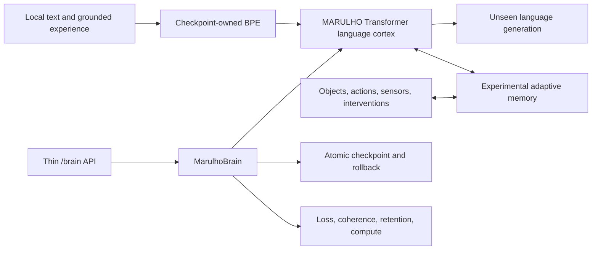

# MARULHO

MARULHO is a local research project for building a continual language system
whose model, tokenizer, memory, learning rules, checkpoints, and evaluation are
owned by MARULHO.

MARULHO is not currently an AGI or a frontier language model. It is an
experimental system running on a single RTX 3060, with a deliberately aggressive
research policy: matched experiments decide which mechanisms survive.

## Architecture

The active language base is a decoder-only causal Transformer implemented in
this repository. It uses:

- a checkpoint-owned BPE tokenizer trained on the selected corpus;
- RMS normalization, rotary positions, causal attention, SwiGLU, and a bounded
  per-layer KV cache;
- full-vocabulary next-token cross-entropy;
- checkpointed model and tokenizer state with no downloaded model weights;
- brain-owned generation through `MarulhoBrain`;
- heldout loss, unseen continuation, checkpoint fidelity, and sustained
  generation as separate measurements.

MARULHO's system shape is:



The Transformer is the fluent cortex, not the whole long-term answer. Once the
base model produces coherent unseen multi-sentence text, the next architectural
candidate is adaptive memory inspired by the PMRM research idea: surprise-
selected episodic memory first, then fast associative updates if the simpler
memory wins. Grounded identity and causal-object experiments from the related
LCO research can later test whether this system learns persistent objects and
interventions rather than text correlations alone.

## Current Evidence

The 2026-07-10 compute-normalized run trained fresh 21M- and 63M-parameter
models with the same 8,192-token MARULHO BPE, two FineWeb-Edu training shards,
disjoint later-offset holdout, optimizer, prompts, and seed.

| Parameters | Update tokens | Heldout loss | Train time | Train tokens/s |
| ---: | ---: | ---: | ---: | ---: |
| 20,976,128 | 20,541,440 | 4.4234 | 283.6 s | 72,435 |
| 20,976,128 | 41,083,648 | 4.0942 | 565.9 s | 72,598 |
| 62,924,544 | 8,388,608 | 5.0050 | 280.3 s | 29,924 |
| 62,924,544 | 16,777,216 | 4.6129 | 560.8 s | 29,914 |

Final training times differ by only 0.9 percent. The 21M model wins by 0.5187
heldout loss at the same RTX 3060 time, and its half-time result already beats
the 63M model's full-time loss. The current branch is therefore to scale data
at 21M, not to grow the dense model.

This is still not a quality promotion. Prose structure improved, but unseen
continuations remain repetitive, sometimes malformed, and weakly tied to their
prompts. The next run needs more unique clean data so repeated-corpus learning
cannot be mistaken for scaling. The evidence artifact is local at
`reports/language_scaling/fineweb-edu-wallclock-21m-vs-63m-20260710.json`.

## Research Objective

MARULHO aims to find a local architecture that is better than a conventional
larger model at a clearly measured task, rather than pretending to reproduce a
frontier model's parameter count on consumer hardware.

The priority order is:

1. Produce coherent unseen multi-sentence language and a reliable heldout
   quality curve.
2. Scale unique clean data at the current 21M local-compute optimum.
3. Measure a local scaling law across model size, data, and compute instead of
   extrapolating from one small run.
4. Add adaptive episodic memory only after the base language checkpoint
   qualifies.
5. Demonstrate sequential-domain learning with bounded forgetting.
6. Restore checkpoint fidelity, measured active compute, and a 524,288-token
   sustained run from that same quality-qualified checkpoint.
7. Test grounded object identity, action binding, and intervention transfer.

The initial scaling model is the standard decomposition
`L(N,D) = E + A/N^alpha + B/D^beta`, measured locally over multiple parameter
and token budgets. Continual-memory experiments will extend it with memory
capacity and online-compute terms only when those variables exist in working
code.

## Ownership Boundaries

- `MarulhoBrain` owns language-model installation, generation, lifecycle, and
  durable checkpoint state.
- `src/marulho/training` owns model and optimization machinery.
- `src/marulho/evaluation` owns experiments and reports; reports do not mutate
  the runtime.
- `src/marulho/service` is a thin adapter and does not own cognition.
- No hidden external LLM, Cortex loop, or ThoughtLoop generates MARULHO output.
- External papers and datasets may inform training, but model weights remain
  MARULHO-owned.
- Throughput, report count, or prompt pass count alone never proves capability.

## Repository Map

- `CONTEXT.md`: current domain language and research decisions.
- `src/marulho/brain`: brain-owned runtime and Transformer installation.
- `src/marulho/training/language_model.py`: active language model contract.
- `src/marulho/training/language_transformer.py`: causal Transformer state
  block and streaming KV state.
- `src/marulho/data/language_tokenizer.py`: byte and BPE tokenizers.
- `src/marulho/evaluation/language_training_experiment.py`: maintained
  training/evaluation runner.
- `src/marulho/evaluation/language_scaling_experiment.py`: matched local
  model-size/token-budget curves and provisional scaling-law fit.
- `src/marulho/evaluation/language_generation_coherence.py`: unseen
  continuation evaluation.
- `src/marulho/evaluation/language_sustained_runtime_evidence.py`: bounded
  sustained generation.
- `src/marulho/core`: separate grounded sparse/column experiments.
- `MARULHO_UI`: local control-room UI.

## Setup

Requirements:

- Python 3.10+
- PyTorch-compatible CPU or CUDA environment
- Node.js only for the optional UI

```powershell
python -m venv .venv
.\.venv\Scripts\activate
pip install -e .[dev]
pytest
```

Inspect the maintained training runner:

```powershell
python -m marulho.evaluation.language_training_experiment --help
```

Example bounded local run:

```powershell
python -m marulho.evaluation.language_training_experiment `
  --corpus reports/language_curriculum/fineweb-edu-train-20k-20260710.txt `
  --eval-corpus reports/language_curriculum/fineweb-edu-eval-2k-offset20k-20260710.txt `
  --output reports/language_training/local-transformer.json `
  --tokenizer-kind bpe `
  --tokenizer-vocab-size 8192 `
  --device auto
```

Run the local API from a brain checkpoint:

```powershell
python -m marulho.service.server --checkpoint checkpoints/marulho/model.pt --port 8000
```

Generated reports and model checkpoints are ignored local artifacts unless a
specific result is promoted into the documentation.

## License

No open-source license has been selected. The public repository is available
for inspection but does not grant reuse rights beyond GitHub's default terms.
