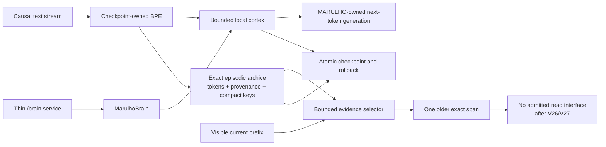

# MARULHO

MARULHO is a local research system for building a continual language model whose
tokenizer, learned weights, memory, learning rules, generation, checkpoints, and
evaluation are owned by this repository. The research target is a model that can
learn from an ongoing stream, recall useful past experience under bounded active
compute, and remain rollbackable while it changes.

MARULHO is not currently an AGI or a frontier model. Its strongest base can
produce readable English, but it is still generic and unreliable on genuinely
unseen, source-grounded continuations. Current results isolate useful exact-
history information but do not yet provide an admitted memory interface or a
generally capable continual model.

## Current architecture

There are three different levels of truth:

1. **Installed runtime:** `MarulhoBrain` owns a 21M-parameter decoder-only causal
   Transformer and its checkpoint-owned BPE tokenizer. This remains the stable
   runtime baseline.
2. **Strongest research cortex:** V11 is an uninstalled 36.18M-parameter causal
   Transformer whose replaced feed-forward block contains deterministic hashed
   singleton micro-experts. Its strict checkpoint has trained for 1.0B update
   tokens.
3. **Memory evidence boundary:** V25 proves that a bounded selector plus one
   exact archived episode improves disjoint causal likelihood. Raw prepending
   fails anchored generation, while V26 and V27 gated readers fail even with
   oracle evidence. No memory model, checkpoint, or runtime integration is
   currently admitted.



The division of labor is deliberate:

- the cortex learns language and reasons over the small amount of evidence that
  is active now;
- no current reader connects the archive to the cortex; both tested gated
  cross-attention placements are retired;
- the archive preserves potentially important experience without forcing every
  detail through a fixed-size recurrent state;
- keys and indexes may be compressed, but valuable episode content stays exact
  until evidence supports a safe consolidation rule;
- selection limits active context instead of pretending that an ever-growing
  prompt is free.

The validated selector is currently lexical TF-IDF, not a learned semantic
memory and not the intended final answer. It is a causal instrument that has
replicated a likelihood win. That signal is retained as evidence, not as an
active architecture; the next work returns to base-language computation before
another memory interface is justified.

MARULHO is not using an SNN, GRU, cortical-column simulation, Hopfield network,
or reservoir as its active language core. Those ideas remain available only
when they express a measurable computational role and can beat matched controls.

## What the evidence supports

| Result | Evidence | Decision |
| --- | --- | --- |
| V11 base cortex | 36.18M parameters; heldout loss 3.0805 after 1.0B update tokens; about 121.9k training tokens/s and 1.97 GB peak allocation on the RTX 3060 | Retain as the strongest sparse research base, but do not call it language-qualified |
| V19/V19b latent memory | Recurrent and partitioned banks reach 30.1% and 31.4% paired source-following and remain more than 16 points behind exact history | Retire the latent memory-token interface |
| V20 addressing audit | Lexical top-one fails its gate; lexical top-two includes the required episode in 98.83% of cases while reading half of the available history | Admit a separate top-two language screen |
| V21 language screen | Lexical top-two reaches 51.6% free exact and 52.0% paired source-following versus all-history at 39.5% and 38.0%; it reads 96 instead of 192 source tokens | Advance exact episodic retrieval to causal document streams |
| V22 document audit | Oracle-one improves loss by 0.0341, but lexical-one's 75.0% retrieval recall yields only +0.0017 and top-two hurts; wrong episodes are about three times as costly as correct episodes are useful | Replace unconditional top-k with a calibration-frozen retrieve-or-abstain gate |
| V22b abstention audit | The frozen gate transfers at 97.84% precision and gains 0.0356 loss, but always-on lexical gains 0.0388 on the same cases | Retire detached correctness gating and co-train the cortex to interpret selected evidence |
| V23 joint document screen | Oracle and true-vs-wrong tests prove learned source use, but lexical's +0.0192 interval crosses zero and general loss regresses +0.1200/+0.1346 | Reject the 75/25 top-one curriculum; run one balanced top-two falsifier |
| V24 balanced top-two | Replay restores retention, but top-two is 0.0064 worse than top-one. The lexical-one control gains a significant +0.0255 while retaining general loss | Retire top-two and replicate top-one against balanced random-one |
| V25 top-one replication | Lexical memory gains +0.0430 over off, beats random, improves both corpora, and retains general loss; all 8 anchored continuations still fail | Preserve the likelihood signal, retire raw concatenation, and build a separate evidence reader |
| V26 final-layer reader | All reader/cortex tensors train, but oracle gain is only +0.00010 and the gate remains near 0.119 | Retire final-layer injection; test interleaved evidence before later cortex layers |
| V27 interleaved reader | Raw context gains +0.0426, but lexical and oracle readers are both about 0.0392 worse than gate-zero; all tensors train and both gates remain near 0.119 | Retire cross-attention document memory and return to the base-language architecture |

V21 also keeps both general-language holdouts within the preregistered 0.10 loss
regression bound and uses about 0.90 GiB peak allocation versus all-history's
1.03 GiB. Its elapsed training time is tied with the controls, so MARULHO makes
no speed claim from this experiment.

The important V21 result is not “TF-IDF solved memory.” It is that selected exact
evidence can outperform both lossy learned compression and indiscriminate full
history. That is the first memory architecture admitted in the current research
iteration.

## What remains unproved

The selected direction still has to show all of the following:

- an evidence interface that converts the retained V25 likelihood signal into
  anchored free generation;
- lower heldout continuation loss and better source-anchored free generation at
  the same time;
- a semantic or learned key that transfers beyond relation templates;
- strict checkpoint fidelity for cortex, archive, index, provenance, optimizer,
  and rollback state;
- coherent multi-sentence generation on genuinely unseen prompts;
- sequential-domain learning with bounded forgetting;
- measured sparse/active compute rather than nominal sparsity;
- a 524,288-token sustained GPU run from the same quality-qualified checkpoint.

Until those are demonstrated, this is an architecture hypothesis with one
positive controlled result—not a replacement for frontier Transformers.

## Current research program

1. Interleave one shared gated cross-attention reader after early/middle V11
   layers while keeping evidence outside the local causal position sequence.
2. Compare gate-zero, shuffled-source, true-source, raw-context, and oracle
   controls on disjoint likelihood, source interventions, anchored generation,
   and general retention.
3. If a selected-evidence arm survives, save one cortex-plus-archive checkpoint
   and test strict reload/rollback.
4. Re-run genuinely unseen Base-Language Qualification from that artifact.
5. Only after base quality survives, test online learning, consolidation,
   forgetting, active compute, and the sustained-runtime ladder.

A negative result is allowed to kill or redesign the archive path. Breaking
changes are expected; failed live machinery is deleted after its evidence is
retained.

## Scientific boundaries

- `external_llm_used=false`: no downloaded model owns language generation.
- `MarulhoBrain` owns cognition; service/status code only exposes it.
- Labels, target slots, oracle routes, and future tokens are metrics-only unless
  a training objective explicitly allows them.
- Every candidate faces matched local, random, recency, full-history, or dense
  controls appropriate to its claim.
- Throughput, one benchmark row, and readable samples do not substitute for
  unseen quality.
- Durable mutation must be checkpointed, hashable, reloadable, and rollbackable.
- CUDA/Triton and sparsity claims describe observed execution, not architecture
  diagrams.

## Repository map

- `CONTEXT.md` — Runtime Truth, current decisions, and evidence pointers.
- `RESEARCH.md` — research synthesis, competing hypotheses, and retired ideas.
- `IDEAS.md` — creative architecture notebook and explicit falsifiers.
- `src/marulho/brain/` — runtime ownership and installed generation path.
- `src/marulho/training/` — tokenizer, causal language model, training, and
  checkpoint machinery.
- `src/marulho/evaluation/` — matched experiments and promotion boundaries.
- `src/marulho/service/` — thin API projection over `MarulhoBrain`.
- `reports/language_scaling/` — local evidence artifacts; large reports and
  checkpoints are intentionally not versioned.

Read `CONTEXT.md` before changing the system, then read the nearest package
README for the machinery being changed.

## Development

```powershell
python -m pip install -e ".[dev,cuda]"
python -m pytest -q
python -m compileall -q src tests
```

The focused tests for the selected V20/V21 branch are:

```powershell
python -m pytest -q `
  tests/test_language_hashed_micro_experts.py `
  tests/test_language_exact_episodic_retrieval_audit.py `
  tests/test_language_exact_episodic_retrieval_screen.py
```
