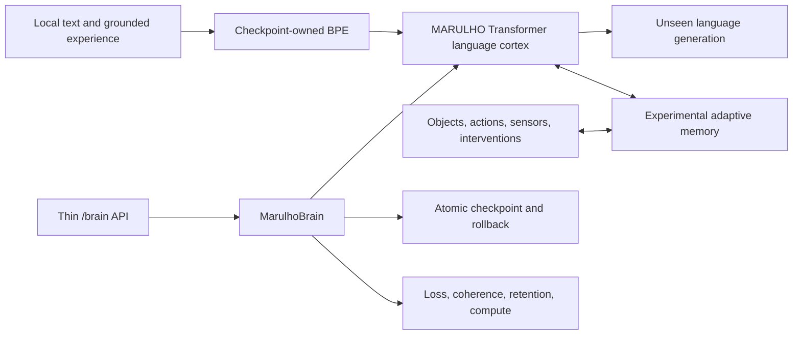

# MARULHO

MARULHO is a local research project for building a continual language system
whose model, tokenizer, memory, learning rules, checkpoints, and evaluation are
owned by MARULHO.

MARULHO is not currently an AGI or a frontier language model. It is an
experimental system running on a single RTX 3060, with a deliberately aggressive
research policy: matched experiments decide which mechanisms survive.

## Architecture

The active language base is a decoder-only causal Transformer implemented in
this repository. It uses:

- a checkpoint-owned BPE tokenizer trained on the selected corpus;
- RMS normalization, rotary positions, causal attention, SwiGLU, and a bounded
  per-layer KV cache;
- full-vocabulary next-token cross-entropy;
- checkpointed model and tokenizer state with no downloaded model weights;
- brain-owned generation through `MarulhoBrain`;
- heldout loss, unseen continuation, checkpoint fidelity, and sustained
  generation as separate measurements.

MARULHO's system shape is:



The Transformer is the fluent cortex, not the whole long-term answer. Once the
base model produces coherent unseen multi-sentence text, the next architectural
candidate is adaptive memory inspired by the PMRM research idea: surprise-
selected episodic memory first, then fast associative updates if the simpler
memory wins. Grounded identity and causal-object experiments from the related
LCO research can later test whether this system learns persistent objects and
interventions rather than text correlations alone.

## Current Evidence

The 2026-07-10 equal-time run selected the 21M model over the 63M model on the
RTX 3060: loss 4.0942 versus 4.6129 after 565.9 versus 560.8 seconds. A fresh
21M run then measured a three-point unique-data curve over 57.96M available
FineWeb-Edu BPE tokens and a disjoint holdout:

| Update tokens | Repeated | Heldout loss | Perplexity | Train time |
| ---: | ---: | ---: | ---: | ---: |
| 16,777,216 | 0 | 4.5754 | 97.07 | 232.6 s |
| 33,554,432 | 0 | 4.1328 | 62.35 | 462.8 s |
| 50,331,648 | 0 | 3.9889 | 54.00 | 693.9 s |

The final point uses 0.87 unique corpus epochs with zero repeated updates. This
is still not a quality promotion: continuations are more prompt-related, but
remain repetitive, sometimes malformed, and incoherent. The marginal loss gain
also contracts sharply in the last interval.

The coherence diagnostic passed. With 250,000 official TinyStories training
records, the complete 21,990-record validation split, and 50.33M unique updates,
the same 21M model reached loss 1.8573 / perplexity 6.41. All four unseen prompts
produced grammatical, prompt-conditioned multi-sentence stories; three emitted
EOS before the 192-token cap.

This does not promote general-language quality. Names still drift, object
properties contradict, character roles blur, and one story does not close. But
it falsifies basic architecture incapacity: the 21M MARULHO Transformer can
learn coherent English. The active blocker is a general curriculum that teaches
structured knowledge and consistency. The [TinyStories paper](https://arxiv.org/abs/2305.07759)
motivates the diagnostic; the next mixture follows the data lesson from
[Hugging Face's SmolLM work](https://huggingface.co/blog/smollm): structured
synthetic textbooks/stories plus deduplicated educational web data. The current
artifact is local at
`reports/language_scaling/tinystories-21m-50m-diagnostic-20260710.json`.

## Research Objective

MARULHO aims to find a local architecture that is better than a conventional
larger model at a clearly measured task, rather than pretending to reproduce a
frontier model's parameter count on consumer hardware.

The priority order is:

1. Produce coherent unseen multi-sentence language and a reliable heldout
   quality curve.
2. Preserve the coherence-qualified 21M recipe.
3. Scale a curated explicit-record general curriculum and test entity/causal
   consistency.
4. Measure a local scaling law across model size, data, and compute instead of
   extrapolating from one small run.
5. Add adaptive episodic memory only after the base language checkpoint
   qualifies.
6. Demonstrate sequential-domain learning with bounded forgetting.
7. Restore checkpoint fidelity, measured active compute, and a 524,288-token
   sustained run from that same quality-qualified checkpoint.
8. Test grounded object identity, action binding, and intervention transfer.

The initial scaling model is the standard decomposition
`L(N,D) = E + A/N^alpha + B/D^beta`, measured locally over multiple parameter
and token budgets. Continual-memory experiments will extend it with memory
capacity and online-compute terms only when those variables exist in working
code.

## Ownership Boundaries

- `MarulhoBrain` owns language-model installation, generation, lifecycle, and
  durable checkpoint state.
- `src/marulho/training` owns model and optimization machinery.
- `src/marulho/evaluation` owns experiments and reports; reports do not mutate
  the runtime.
- `src/marulho/service` is a thin adapter and does not own cognition.
- No hidden external LLM, Cortex loop, or ThoughtLoop generates MARULHO output.
- External papers and datasets may inform training, but model weights remain
  MARULHO-owned.
- Throughput, report count, or prompt pass count alone never proves capability.

## Repository Map

- `CONTEXT.md`: current domain language and research decisions.
- `src/marulho/brain`: brain-owned runtime and Transformer installation.
- `src/marulho/training/language_model.py`: active language model contract.
- `src/marulho/training/language_transformer.py`: causal Transformer state
  block and streaming KV state.
- `src/marulho/data/language_tokenizer.py`: byte and BPE tokenizers.
- `src/marulho/evaluation/language_training_experiment.py`: maintained
  training/evaluation runner.
- `src/marulho/evaluation/language_scaling_experiment.py`: matched local
  model-size/token-budget curves and provisional scaling-law fit.
- `src/marulho/evaluation/language_generation_coherence.py`: unseen
  continuation evaluation.
- `src/marulho/evaluation/language_sustained_runtime_evidence.py`: bounded
  sustained generation.
- `src/marulho/core`: separate grounded sparse/column experiments.
- `MARULHO_UI`: local control-room UI.

## Setup

Requirements:

- Python 3.10+
- PyTorch-compatible CPU or CUDA environment
- Node.js only for the optional UI

```powershell
python -m venv .venv
.\.venv\Scripts\activate
pip install -e .[dev]
pytest
```

Inspect the maintained training runner:

```powershell
python -m marulho.evaluation.language_training_experiment --help
```

Example bounded local run:

```powershell
python -m marulho.evaluation.language_training_experiment `
  --corpus reports/language_curriculum/fineweb-edu-train-20k-20260710.txt `
  --eval-corpus reports/language_curriculum/fineweb-edu-eval-2k-offset20k-20260710.txt `
  --output reports/language_training/local-transformer.json `
  --tokenizer-kind bpe `
  --tokenizer-vocab-size 8192 `
  --device auto
```

Run the local API from a brain checkpoint:

```powershell
python -m marulho.service.server --checkpoint checkpoints/marulho/model.pt --port 8000
```

Generated reports and model checkpoints are ignored local artifacts unless a
specific result is promoted into the documentation.

## License

No open-source license has been selected. The public repository is available
for inspection but does not grant reuse rights beyond GitHub's default terms.
