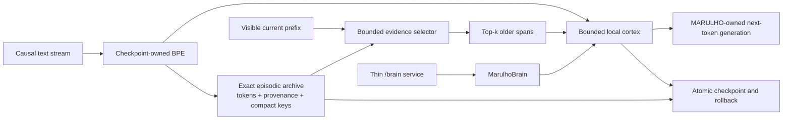

# MARULHO

MARULHO is a local research system for building a continual language model whose
tokenizer, learned weights, memory, learning rules, generation, checkpoints, and
evaluation are owned by this repository. The research target is a model that can
learn from an ongoing stream, recall useful past experience under bounded active
compute, and remain rollbackable while it changes.

MARULHO is not currently an AGI or a frontier model. Its strongest base can
produce readable English, but it is still generic and unreliable on genuinely
unseen, source-grounded continuations. Current results support a new memory
direction; they do not yet establish a generally capable continual model.

## Current architecture

There are three different levels of truth:

1. **Installed runtime:** `MarulhoBrain` owns a 21M-parameter decoder-only causal
   Transformer and its checkpoint-owned BPE tokenizer. This remains the stable
   runtime baseline.
2. **Strongest research cortex:** V11 is an uninstalled 36.18M-parameter causal
   Transformer whose replaced feed-forward block contains deterministic hashed
   singleton micro-experts. Its strict checkpoint has trained for 1.0B update
   tokens.
3. **Selected memory hypothesis:** V21 combines a local V11-style cortex with a
   growing exact episodic archive and a bounded selector. This passed a
   controlled relation-binding screen, but it has no promoted checkpoint or
   runtime integration yet.



The division of labor is deliberate:

- the cortex learns language and reasons over the small amount of evidence that
  is active now;
- the archive preserves potentially important experience without forcing every
  detail through a fixed-size recurrent state;
- keys and indexes may be compressed, but valuable episode content stays exact
  until evidence supports a safe consolidation rule;
- selection limits active context instead of pretending that an ever-growing
  prompt is free.

The selector is currently lexical TF-IDF, not a learned semantic memory and not
the intended final answer. It is a clean causal instrument for testing whether
selecting exact experience is useful before investing in a learned router.

MARULHO is not using an SNN, GRU, cortical-column simulation, Hopfield network,
or reservoir as its active language core. Those ideas remain available only
when they express a measurable computational role and can beat matched controls.

## What the evidence supports

| Result | Evidence | Decision |
| --- | --- | --- |
| V11 base cortex | 36.18M parameters; heldout loss 3.0805 after 1.0B update tokens; about 121.9k training tokens/s and 1.97 GB peak allocation on the RTX 3060 | Retain as the strongest sparse research base, but do not call it language-qualified |
| V19/V19b latent memory | Recurrent and partitioned banks reach 30.1% and 31.4% paired source-following and remain more than 16 points behind exact history | Retire the latent memory-token interface |
| V20 addressing audit | Lexical top-one fails its gate; lexical top-two includes the required episode in 98.83% of cases while reading half of the available history | Admit a separate top-two language screen |
| V21 language screen | Lexical top-two reaches 51.6% free exact and 52.0% paired source-following versus all-history at 39.5% and 38.0%; it reads 96 instead of 192 source tokens | Advance exact episodic retrieval to causal document streams |
| V22 document audit | Oracle-one improves loss by 0.0341, but lexical-one's 75.0% retrieval recall yields only +0.0017 and top-two hurts; wrong episodes are about three times as costly as correct episodes are useful | Replace unconditional top-k with a calibration-frozen retrieve-or-abstain gate |

V21 also keeps both general-language holdouts within the preregistered 0.10 loss
regression bound and uses about 0.90 GiB peak allocation versus all-history's
1.03 GiB. Its elapsed training time is tied with the controls, so MARULHO makes
no speed claim from this experiment.

The important V21 result is not “TF-IDF solved memory.” It is that selected exact
evidence can outperform both lossy learned compression and indiscriminate full
history. That is the first memory architecture admitted in the current research
iteration.

## What remains unproved

The selected direction still has to show all of the following:

- a confidence-gated retrieval win on causal, document-disjoint general text;
- lower heldout continuation loss and better source-anchored free generation at
  the same time;
- a semantic or learned key that transfers beyond relation templates;
- strict checkpoint fidelity for cortex, archive, index, provenance, optimizer,
  and rollback state;
- coherent multi-sentence generation on genuinely unseen prompts;
- sequential-domain learning with bounded forgetting;
- measured sparse/active compute rather than nominal sparsity;
- a 524,288-token sustained GPU run from the same quality-qualified checkpoint.

Until those are demonstrated, this is an architecture hypothesis with one
positive controlled result—not a replacement for frontier Transformers.

## Current research program

1. Calibrate a retrieve-or-abstain threshold on separate replay documents using
   visible-prefix score margin only, then freeze it before disjoint evaluation.
2. Compare gated lexical/frozen keys with local-only and equal-write-rate random
   and recency controls on disjoint FineWeb-Edu and Cosmopedia documents.
3. If the frozen gate survives, jointly train it and require both likelihood and
   anchored-generation improvement before saving one selected
   cortex-plus-archive checkpoint and testing strict reload/rollback.
4. Re-run genuinely unseen Base-Language Qualification from that artifact.
5. Only after base quality survives, test online learning, consolidation,
   forgetting, active compute, and the sustained-runtime ladder.

A negative result is allowed to kill or redesign the archive path. Breaking
changes are expected; failed live machinery is deleted after its evidence is
retained.

## Scientific boundaries

- `external_llm_used=false`: no downloaded model owns language generation.
- `MarulhoBrain` owns cognition; service/status code only exposes it.
- Labels, target slots, oracle routes, and future tokens are metrics-only unless
  a training objective explicitly allows them.
- Every candidate faces matched local, random, recency, full-history, or dense
  controls appropriate to its claim.
- Throughput, one benchmark row, and readable samples do not substitute for
  unseen quality.
- Durable mutation must be checkpointed, hashable, reloadable, and rollbackable.
- CUDA/Triton and sparsity claims describe observed execution, not architecture
  diagrams.

## Repository map

- `CONTEXT.md` — Runtime Truth, current decisions, and evidence pointers.
- `RESEARCH.md` — research synthesis, competing hypotheses, and retired ideas.
- `IDEAS.md` — creative architecture notebook and explicit falsifiers.
- `src/marulho/brain/` — runtime ownership and installed generation path.
- `src/marulho/training/` — tokenizer, causal language model, training, and
  checkpoint machinery.
- `src/marulho/evaluation/` — matched experiments and promotion boundaries.
- `src/marulho/service/` — thin API projection over `MarulhoBrain`.
- `reports/language_scaling/` — local evidence artifacts; large reports and
  checkpoints are intentionally not versioned.

Read `CONTEXT.md` before changing the system, then read the nearest package
README for the machinery being changed.

## Development

```powershell
python -m pip install -e ".[dev,cuda]"
python -m pytest -q
python -m compileall -q src tests
```

The focused tests for the selected V20/V21 branch are:

```powershell
python -m pytest -q `
  tests/test_language_hashed_micro_experts.py `
  tests/test_language_exact_episodic_retrieval_audit.py `
  tests/test_language_exact_episodic_retrieval_screen.py
```
