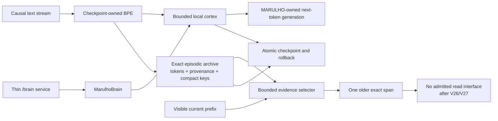

# MARULHO

MARULHO is a local research system for building a continual language model whose
tokenizer, learned weights, memory, learning rules, generation, checkpoints, and
evaluation are owned by this repository. The research target is a model that can
learn from an ongoing stream, recall useful past experience under bounded active
compute, and remain rollbackable while it changes.

MARULHO is not currently an AGI or a frontier model. Its strongest research
checkpoint produces coherent multi-sentence English and has passed one narrow
continual-learning test: it learned held-out synthetic relations while retaining
its general-language loss. A corrected generated-only decode policy reveals
88.67% strict free accuracy on that narrow benchmark, but container remains
60.94%, open text is still semantically unreliable, and no general grounding
claim follows. There is still no admitted long-term memory read interface or
generally capable continual model.

## Current architecture

There are nine different levels of truth:

1. **Installed runtime:** `MarulhoBrain` owns a 21M-parameter decoder-only causal
   Transformer and its checkpoint-owned BPE tokenizer. This remains the stable
   runtime baseline.
2. **Retained sparse research evidence:** V11 is an uninstalled 36.18M-parameter causal
   Transformer whose replaced feed-forward block contains deterministic hashed
   singleton micro-experts. Its strict checkpoint has trained for 1.0B update
   tokens.
3. **Memory evidence boundary:** V25 proves that a bounded selector plus one
   exact archived episode improves disjoint causal likelihood. Raw prepending
   fails anchored generation, while V26 and V27 gated readers fail even with
   oracle evidence. No memory model, checkpoint, or runtime integration is
   currently admitted.
4. **Active optimizer experiment:** V29 keeps the exact 20.976M Transformer
   fixed and compares AdamW with matrix-orthogonalized Muon at two learning
   rates. At 16.78M tokens, Muon 1e-3 beats same-rate AdamW by 0.1645 heldout
   loss and 12.11 points of exact free generation. This admits checkpoint
   reproduction, which passes bit-exact reload. Unseen prose remains 0/8 and
   semantically unstable, so Muon is retained as a training improvement rather
   than a quality-qualified model or runtime optimizer.
5. **Strongest general base candidate:** V30 selects context 72 after removing
   synthetic relation updates. V31 then trains the same fresh 20.976M model on
   67.11M non-repeated tokens and improves common loss/perplexity from
   4.0093/55.11 to 3.6291/37.68. FineWeb-Edu/Cosmopedia unseen loss also falls
   to 4.2053/3.4896. Text is more grammatical, but remains 0/8 on anchored
   cases, generic, and factually unstable, so the checkpoint is retained for a
   larger data curve rather than installed as a qualified base. V32's fresh
   201.32M-token point improves loss only to 3.4983, a +0.1308 gain that misses
   its frozen +0.20 gate. V34 then expands the same general recipe to a fresh
   100.68M-parameter Transformer. At the same 67.11M-token budget it reaches
   loss/perplexity 3.3902/29.67 versus V31's 3.6291/37.68, passing its +0.20
   gate with exact checkpoint reload. Unseen prose is clearly more grammatical
   and multi-sentence, but remains generic and 0/8 source-anchored; the checkpoint
   is retained for a new-data continuation, not installed. V35's continuation
   reaches diagnostic loss 3.1654, but its manifest schedules 58,255 of 58,257
   prepared unique batches. The full-coverage gate correctly marks it invalid
   and no checkpoint survives. V35R reruns from V34 with exactly the two missing
   batches and no quality-gate change. The valid rerun reaches loss/perplexity
   3.1649/23.69 after 201.34M cumulative tokens and strict-reloads its checkpoint.
   Unseen FineWeb and Cosmopedia loss improve to 3.8020 and 2.9282; controlled
   generations are now coherent multi-sentence paragraphs. Exact source anchoring
   remains 0/8, so this qualifies a base-language research checkpoint, not
   grounded memory or runtime installation.
6. **Architecture search:** V28's particle field and V33's local-attention plus
   editable matrix state are retired. V33 was a valid exact-parameter test and
   nearly tied loss (4.0056 versus 4.0082), but its 0.0025 gain missed the 0.02
   gate while retaining only 75.5% throughput and using 1.41 times peak memory.
   No checkpoint or event-control phase survives. No biological metaphor or
   many-small-units design is a requirement; every mechanism must earn its place.
7. **Strongest continual research checkpoint:** V39 starts from V35R and mixes
   new relation examples with fresh general-language replay. A normalized 4x
   answer-span objective reaches 98.44% candidate accuracy while improving
   heldout general loss from 3.1649 to 3.1134. Its original prompt-inclusive
   no-repeat evaluation reported 50.00% strict free recall; V44 corrects the
   decode scope and measures 88.67% from the unchanged checkpoint. The
   100.68M-parameter checkpoint reloads exactly after 218.11M cumulative tokens.
   This is a narrow learning-without-forgetting result, not general reasoning:
   ownership/property reach 100%, event order 93.75%, and container remains the
   weak type at 60.94%.
8. **Qualified sustained research runtime:** V45 loads that exact V39 artifact
   under generated-only decode controls and generates 256 independent 2,048-
   token streams on the RTX 3060. All 524,288 tokens complete in 73.16 seconds
   at 7,167 tokens/s with 3.17 GB peak allocation and unchanged model tensors.
   Execution hooks observe every one of the 100.68M parameters, so the current
   path is measured dense, not sparse. Long samples still drift and hallucinate;
   this qualifies runtime stability, not long-generation quality.
9. **General grounding boundary:** V47 gives V39 visible held-out SQuAD evidence
   and measures only 3/64 exact answers. V48 then trains two exact-reset 4.19M-
   token arms. Ordinary loss reaches 9/64 and answer-weighted loss reaches 14/64,
   proving that answer emphasis helps source use. Neither survives retention:
   the frozen 64-case relation panel falls from 89.06% to 40.62%/43.75%, and
   general loss regresses by 0.1045/0.1023. V48 therefore retires monolithic
   objective-only repair. V49 freezes V39 and trains a 4.13M-parameter final
   causal sidecar: inactive retention is exact and training is fast, but active
   grounding falls to 1/64. V50 moves rank-16 deltas into every layer and reaches
   5/64 with exact retention—better, but still far behind V48's 14/64. V51 removes
   the capacity excuse by training a complete 100.68M-parameter isolated fork;
   it reaches 12/64 with a real 17.19-point source gain, but still loses to V48
   and overfits its general holdout from 3.1490 to 5.1532. A post-run alignment
   audit then found that stream packing kept the complete context, question, and
   answer together for only 80/512 training records. These arms are terminal for
   the pipeline they actually ran, but do not establish a capacity-independent
   limit under correctly aligned records. Shared plasticity,
   compact sidecars, hierarchical low-rank deltas, and full specialist copying
   are retired; no checkpoint or live compatibility path survives.


```mermaid
flowchart LR
    Stream["Causal text stream"] --> Tok["Checkpoint-owned BPE"]
    Tok --> Local["Bounded local cortex"]
    Tok --> Archive["Exact episodic archive<br/>tokens + provenance + compact keys"]
    Prefix["Visible current prefix"] --> Select["Bounded evidence selector"]
    Archive --> Select
    Select --> Evidence["One older exact span"]
    Evidence --> Boundary["No admitted read interface<br/>after V26/V27"]
    Local --> Output["MARULHO-owned next-token generation"]
    Local --> Save["Atomic checkpoint and rollback"]
    Archive --> Save
    Brain["MarulhoBrain"] --> Local
    Service["Thin /brain service"] --> Brain
```

The division of labor is deliberate:

- the cortex learns language and reasons over the small amount of evidence that
  is active now;
- no current reader connects the archive to the cortex; both tested gated
  cross-attention placements are retired;
- the archive preserves potentially important experience without forcing every
  detail through a fixed-size recurrent state;
- keys and indexes may be compressed, but valuable episode content stays exact
  until evidence supports a safe consolidation rule;
- selection limits active context instead of pretending that an ever-growing
  prompt is free.

The validated selector is currently lexical TF-IDF, not a learned semantic
memory and not the intended final answer. It is a causal instrument that has
replicated a likelihood win. That signal is retained as evidence, not as an
active architecture; the next work returns to base-language computation before
another memory interface is justified.

MARULHO is not using an SNN, GRU, cortical-column simulation, Hopfield network,
or reservoir as its active language core. Those ideas remain available only
when they express a measurable computational role and can beat matched controls.

## What the evidence supports

| Result | Evidence | Decision |
| --- | --- | --- |
| V11 base cortex | 36.18M parameters; heldout loss 3.0805 after 1.0B update tokens; about 121.9k training tokens/s and 1.97 GB peak allocation on the RTX 3060 | Retain as the strongest sparse research base, but do not call it language-qualified |
| V19/V19b latent memory | Recurrent and partitioned banks reach 30.1% and 31.4% paired source-following and remain more than 16 points behind exact history | Retire the latent memory-token interface |
| V20 addressing audit | Lexical top-one fails its gate; lexical top-two includes the required episode in 98.83% of cases while reading half of the available history | Admit a separate top-two language screen |
| V21 language screen | Lexical top-two reaches 51.6% free exact and 52.0% paired source-following versus all-history at 39.5% and 38.0%; it reads 96 instead of 192 source tokens | Advance exact episodic retrieval to causal document streams |
| V22 document audit | Oracle-one improves loss by 0.0341, but lexical-one's 75.0% retrieval recall yields only +0.0017 and top-two hurts; wrong episodes are about three times as costly as correct episodes are useful | Replace unconditional top-k with a calibration-frozen retrieve-or-abstain gate |
| V22b abstention audit | The frozen gate transfers at 97.84% precision and gains 0.0356 loss, but always-on lexical gains 0.0388 on the same cases | Retire detached correctness gating and co-train the cortex to interpret selected evidence |
| V23 joint document screen | Oracle and true-vs-wrong tests prove learned source use, but lexical's +0.0192 interval crosses zero and general loss regresses +0.1200/+0.1346 | Reject the 75/25 top-one curriculum; run one balanced top-two falsifier |
| V24 balanced top-two | Replay restores retention, but top-two is 0.0064 worse than top-one. The lexical-one control gains a significant +0.0255 while retaining general loss | Retire top-two and replicate top-one against balanced random-one |
| V25 top-one replication | Lexical memory gains +0.0430 over off, beats random, improves both corpora, and retains general loss; all 8 anchored continuations still fail | Preserve the likelihood signal, retire raw concatenation, and build a separate evidence reader |
| V26 final-layer reader | All reader/cortex tensors train, but oracle gain is only +0.00010 and the gate remains near 0.119 | Retire final-layer injection; test interleaved evidence before later cortex layers |
| V27 interleaved reader | Raw context gains +0.0426, but lexical and oracle readers are both about 0.0392 worse than gate-zero; all tensors train and both gates remain near 0.119 | Retire cross-attention document memory and return to the base-language architecture |

V21 also keeps both general-language holdouts within the preregistered 0.10 loss
regression bound and uses about 0.90 GiB peak allocation versus all-history's
1.03 GiB. Its elapsed training time is tied with the controls, so MARULHO makes
no speed claim from this experiment.

The important V21 result is not “TF-IDF solved memory.” It is that selected exact
evidence can outperform both lossy learned compression and indiscriminate full
history. That is the first memory architecture admitted in the current research
iteration.

## What remains unproved

The selected direction still has to show all of the following:

- an evidence interface that converts the retained V25 likelihood signal into
  anchored free generation;
- lower heldout continuation loss and better source-anchored free generation at
  the same time;
- a semantic or learned key that transfers beyond relation templates;
- strict checkpoint fidelity for a future archive, index, provenance, optimizer,
  and rollback state;
- sequential-domain learning that generalizes beyond the narrow synthetic V39
  relation family;
- a conditional memory or compute path that beats the measured 100%-dense V39
  runtime on quality per local compute.

Until those are demonstrated, this is an architecture hypothesis with one
positive controlled result—not a replacement for frontier Transformers.

## Current research program

1. Treat V33 as closed evidence: replacing half the token Transformer with an
   editable matrix state did not buy enough language quality, speed, or memory.
2. Retain V34 as the parent of the first local 100.68M trajectory: its +0.2389
   heldout gain justified continuation, but V35R supersedes it as the live
   research checkpoint.
3. Treat V35's 3.1654 loss as diagnostic only: two prepared batches were absent
   from its frozen schedule, so the evidence is invalid and no checkpoint exists.
   V35R reruns from V34 on all 58,257 hash-pinned batches (134,224,128 new;
   201,335,040 cumulative tokens), passes the unchanged +0.15 gate by 0.0753,
   and produces coherent unseen paragraphs. Preserve the 0/8 anchoring failure
   as the boundary between base-language qualification and grounded memory.
4. Keep dynamic byte hierarchies as a later scale-aware direction. Published
   H-Net evidence begins around 680M parameters and tens of billions of bytes,
   so a 21M imitation is not the next credible 3060 experiment.
5. Use V36's quality-safe RTX 3060 recipe for the next durable run. On 2.36M
   identical ordered tokens, physical batch 256 with whole-QKV Muon at 3e-4
   reaches loss 3.1423 at 25.07k tokens/s versus batch 32's 3.2455 at 11.08k:
   2.262 times the throughput and better loss. Higher learning rates are worse.
   Per-head Muon is useful at batch 32 but does not justify replacing whole-QKV
   Muon at the advancing batch size.
6. Reopen exact episodic memory, online learning, consolidation, forgetting,
   active compute, and the sustained runtime ladder from V35R.
   V37's full-width depth assembly is retired after exceeding a fixed one-hour
   run and reaching 11.74/12.29 GiB observed device allocation without terminal
   quality evidence. A successor may test fused low-rank depth channels, but may
   not restore all-depth activation retention. Do not call the still-unanchored
   generator runtime-qualified.
7. Treat V38 as a near-positive continual result, not a promoted checkpoint.
   The 50/50 replay arm reaches 100% relation recognition, 46.88% strict free
   answers, and improves old-language loss to 3.1124, but misses the 50% free
   gate. V39 must improve exact answer formation under the same replay/compute
   budget; do not add capacity, weaken evaluation, or repeat replay ratios.
8. Retain V39 as the first continual-qualified 100M checkpoint. Its 4x
   answer-emphasis arm reaches 98.44% ranked, improves general loss to 3.1134,
   and reloads exactly after 218.11M cumulative tokens. The immutable V39 report
   records 50% strict free relations under the then-current prompt-inclusive
   no-repeat policy; V44 later corrects that policy and measures 88.67% from the
   same tensors. Container remains only 39/64, so this is not general binding.
9. Retain V40 as the same-checkpoint runtime qualification. Its 256 independently
   prompted CUDA streams each produce 2,048 consecutive tokens, totaling 524,288
   in 74.84 seconds at 7,005 tokens/s. Model state is immutable and bounded;
   observed parameter coverage is 100%, so there is no sparse-compute win yet.
10. Retire V41 hidden-state episodic memory. Its 65,536 training-only keys move
    strict free accuracy only from 50.00% to 51.56%, entirely through property;
    ownership stays 6.25% and container falls to 20.31%. Shuffled values prove
    the intervention is causal, while 740.95M dense key comparisons and no
    binding gain reject this interface. No checkpoint or code survives.
11. Retire V42 without a quality claim. Tokenizer-trie role contrast passed
    mechanical checks, but its exact eager pilot saturated the RTX 3060 for
    16,507.6 seconds without persisting an arm result. No checkpoint or live
    V42 code remains. The shared runner now owns real-step wall-time rejection
    and atomic exact-contract arm artifacts. Its real V39/Muon GPU check selects
    effective batch 224 at 19.22k training tokens/s and 10.49 GB peak allocation;
    batch 256 is rejected after memory pressure collapses throughput. This clears
    the execution-infrastructure gate, not a training-quality gate.
12. Stop V43 before implementation. Only 66.53% of correct-answer BPE tokens
    occur anywhere in the prompt against its frozen 85% copyability gate, and no
    complete answer span occurs. A prompt-copy readout cannot explain the free-
    generation gap as proposed, so no code or checkpoint is created.
13. Promote V44's generated-only decode controls. The old no-repeat-3 history
    included the prompt and therefore forbade factual answers from reusing source
    triples. Restricting controls to generated continuation history raises the
    unchanged V39 checkpoint from 50.00% to 88.67% strict free accuracy while
    ranked accuracy stays 98.44% and model hashes remain exact. V40 must be rerun
    because its long-generation policy changed.
14. Qualify V45 as that rerun. The exact same checkpoint emits 524,288/524,288
    tokens in 73.16 seconds at 7,166.7 tokens/s with 3.165 GB peak allocation,
    exact state hashes, zero invalid or nonfinite outputs, bounded state, and
    100% observed parameter execution. It remains a dense runtime, and preview
    drift prevents a long-generation-quality claim.
15. Retain V46 as a corrected exact-continuation negative, not a grounding test.
    V39 remains 0/12 from three-word heldout prefixes; versus V35R its loss is
    +0.0395 on FineWeb-Edu and -0.0686 on Cosmopedia. The evaluator now excludes
    a spurious second BOS and scans only a bounded stable token prefix. Because
    the source document is hidden from the model, the next benchmark supplies
    real unseen evidence and uses question-only/corrupted-source controls.
16. Retain V47 as the first valid source-visible general grounding baseline.
    On 64 immutable SQuAD validation cases, the unchanged V39 checkpoint answers
    3/64 with intact evidence and 0/64 under both question-only and mismatched-
    source controls. The 4.69-point source gain misses the frozen 5-point weak-
    use threshold and the 25% capability gate, admitting continual grounding
    training on the disjoint official training split with relation/general replay.
17. Retire V48's objective-only grounding repair. At 4,193,280 matched tokens,
    ordinary/answer-weighted training reaches 14.06%/21.88% held-out SQuAD
    accuracy with +12.50/+20.31 source-control gains. The 4x arm beats ordinary
    by 7.81 points, so answer weighting is useful, but both arms destroy more
    than 45 relation points and regress the matched general holdout by about
    0.10. True batch-8 gradient accumulation avoids the failed paged batch-224
    path, sustaining 5.43k/5.36k tokens/s at 3.19/2.20 GiB measured allocation.
    No candidate or temporary arm checkpoint remains. V49 must test isolated,
    conditionally activated plasticity rather than another replay ratio.
18. Retire V49's final-layer conditional sidecar. Its 4,130,304 trainable
    parameters are only 4.10% of V39, all receive gradients, and 2,096,640
    SQuAD tokens train in 37.81 seconds at 55.45k tokens/s with 2.20 GiB peak
    allocation. Isolation works exactly: parent hashes/logits, general loss
    3.149026, relation ranking 98.44%, and free recall 89.06% are unchanged when
    inactive. Active grounding nevertheless falls to 1/64 versus V39's 3/64
    and V48's 14/64. The final representation is not a sufficient plasticity
    interface; the model, runner, checkpoint surface, and tests are deleted.
19. Retire V50's hierarchical conditional low-rank deltas. Rank-16 updates on
    every attention and SwiGLU projection add 2,457,600 parameters (2.44% of
    V39); all receive nonzero gradients and loss falls from 3.55 to 2.76. Active
    grounding improves over V49 to 5/64, but remains nine cases behind V48 and
    produces only a 7.81-point causal source gain. Inactive parent/logit/loss/
    relation evidence is exact. Training sustains 23.62k tokens/s for 88.76
    seconds at 8.35 GiB peak. The implementation and checkpoint surface are
    deleted. The next module must have substantially more functional freedom
    than low-rank deltas or own a separate source encoder.
20. Retire V51's full specialist fork. A complete 100,679,424-parameter V39 copy
    receives the same 2,096,640 SQuAD tokens and gradients reach every parameter.
    It trains in 395.80 seconds at 5.30k tokens/s with 3.19 GiB peak allocation.
    Intact/question-only/mismatched grounding is 12/64, 1/64, and 1/64: genuine
    source use, but two cases worse than V48 and six below the gate. Training loss
    collapses to 0.010 while its general holdout worsens from 3.1490 to 5.1532,
    identifying narrow memorization in the executed stream-packed curriculum.
    A subsequent audit finds only 80/512 complete prompt-answer records in one
    context window, so the broader capacity conclusion is withheld.
    The immutable parent remains exact. The fork runner, tests, and checkpoints
    are deleted; the next falsifier must change source representation or learning
    signal, not add another larger isolated parameter path.
21. Validate V52's document-aligned correction. Each SQuAD record already fits
    in at most 73 tokens, but global stride-72 packing cuts 432/512 records across
    windows. V52 right-pads each record only after EOS, excludes pad targets, and
    keeps its full prompt and answer in one causal example. Everything else stays
    matched to V48's answer-weighted arm: V39 reset, 4,193,280 total processed
    tokens, 50% SQuAD, 50% identical replay sources, 4x answer loss, optimizer,
    validation controls, and retention gates. It must reach at least 18/64 intact
    answers, gain ten points over controls, and beat V48 by five points. A source
    arm reaches 19/64 intact answers versus 0/64 for both controls, beating V48
    by five cases and passing every capability check. Alignment also improves
    retention relative to V48, but relation recall still falls from 89.06% to
    56.25% and general loss regresses +0.0902. No checkpoint survives. The
    document-aligned contract is retained; its one-off runner and tests are
    deleted. V53 must place the validated signal behind a frozen-base copy/span
    path so learning cannot rewrite old language behavior.
22. Retire V53's frozen source pointer. V39 remains immutable. The 99,073-
    parameter rank-64 head is only 0.098% of the parent, trains every parameter
    in 185.39 seconds at 11.31k tokens/s with 0.56 GiB peak allocation, and keeps
    parent checkpoint/state/logits/general/relation evidence exact. It reaches
    17/64 intact answers with both controls at zero—better than V48, but one case
    below the 18/64 floor and two below V52. The result is promising but fails
    the frozen gate, so no checkpoint or compatibility path survives. V54 must
    add a trainable source encoder or direct span supervision.
23. Retire V54's trainable source encoder. Its 373,506 parameters are only
    0.371% of V39, all receive nonzero gradients, and direct span loss falls
    from 3.4005 to 1.5942. Training is extremely cheap at 173.97k padded
    positions/s and 0.46 GiB peak allocation, while the parent and compact
    checkpoint reload remain exact. Unseen grounding nevertheless reaches only
    16/64 with both controls at zero, below V53's 17 and V52's 19. Ten misses
    contain incomplete answer fragments, exposing a boundary/assembly failure.
    No V54 checkpoint, encoder, runner, tests, loader, or compatibility path
    survives. The next branch must combine complementary causal and
    bidirectional views with learned answer generation rather than enlarge the
    failed span head.
24. Retire V55's multi-view answer transducer. The corrected 8,192-case
    curriculum is 16 times larger than V54 and all 2,130,819 parameters train.
    Loss falls from 4.1729 to 1.1699 over 8,847,360 positions at 60.83k training
    positions/s; causal caching plus training takes 157.60 seconds. Exact parent
    isolation and compact reload pass. The fused organ reaches 20/64 versus
    16/64 causal-only and 2/64 bidirectional-only, exactly passing the four-case
    synergy bar, but controls remain zero and capability misses the required
    32/64. Fourteen misses contain answer fragments, often corrupted by
    noncontiguous BPE-position assembly. No V55 checkpoint, model, runner,
    tests, loader, cache, or compatibility path survives. The source branch now
    pivots away from token-pointer heads toward longer-context retrieval with
    token-safe segment realization.
25. Retire V56's landmark evidence retrofit. Its 2.38M trainable parameters
    receive complete gradients while frozen V39 remains exact. Loss falls from
    6.4843 to 2.8132 across 20,643,840 adapter positions at 77.0k positions/s.
    The retriever puts the complete answer in its predicted top-two blocks for
    91/128 heldout cases, below the 80% gate. More decisively, predicted, oracle,
    and shuffled evidence all produce 0/128 exact answers; question-only happens
    to produce 1/128. Even correct evidence cannot make the small residual path
    control V39's answer realization. The model, runner, tests, cache, and
    checkpoint surface are deleted. The next branch expands native context or
    tests recurrent segment memory, not another frozen answer head.
26. Retire V57's full-model native-context continuation. Both exact-reset 100.7M
    arms process 20,971,520 positions with complete final gradients and exact
    reload. Oracle-localized evidence reaches 122/256 exact answers, six below
    the gate; full-source context reaches only 43/256, though the same native
    model reaches 90/256 when evaluated with localized evidence. General loss
    regresses from 3.1490 to 3.3712/3.3553 and relation generation from 89.06%
    to 34.38%/75.00%. Training sustains 16.77k/17.03k positions/s. The result
    rejects context expansion plus unrestricted full-model fine-tuning: evidence
    localization is real, but the privileged arm still misses capability and
    overwrites retained behavior. No candidate or V57 machinery survives.
27. Retire V58's protected full-capacity evidence organ. Its 100.69M trainable
    parameters complete all 2,048 updates at 24.06k positions/s with every final
    gradient nonzero and exact V39 fidelity. The mechanical copy oracle is
    256/256, but title-disjoint learned extraction reaches only 20/256 versus
    0/256 mismatched, far below the required 192/256 and 70-point source gain.
    No random-init control or checkpoint is admitted. This closes the V53--V58
    SQuAD pointer/span family; the next hypothesis must use protected write-time
    learning rather than another answer-span head.
28. Retire V59's naive source-native write-time learner. All true-source losses
    improve and every transient full-model tensor trains, but no-write, wrong-
    source, true-source, and oracle-short writes all score 0/64 strict answers.
    True and oracle writes contain an accepted answer in 5/64 verbose outputs,
    versus zero for controls, so gradients create a weak source bias but not a
    readable memory. Exact resets and parent fidelity pass; the failed code and
    transient states are deleted. A future TTT-like write rule must be
    meta-trained for later readout.
29. Test V60's meta-gradient episodic matrix. Frozen V39 source states write
    exact next-token embedding associations into a small temporary eight-head
    matrix; a sub-1% slow controller is trained end-to-end so later question
    states can read it through V39's own vocabulary head. The source-only write
    never sees questions or answers, and each document state is discarded.
    Zero, shuffled, true, and oracle memory views decide whether this learned
    write/read contract transfers to all 22 unseen validation titles.

A negative result is allowed to kill or redesign the archive path. Breaking
changes are expected; failed live machinery is deleted after its evidence is
retained. MARULHO has no external users yet, so hypothetical compatibility is
not a reason to keep dead paths.

## Scientific boundaries

- `external_llm_used=false`: no downloaded model owns language generation.
- `MarulhoBrain` owns cognition; service/status code only exposes it.
- Labels, target slots, oracle routes, and future tokens are metrics-only unless
  a training objective explicitly allows them.
- Every candidate faces matched local, random, recency, full-history, or dense
  controls appropriate to its claim.
- Throughput, one benchmark row, and readable samples do not substitute for
  unseen quality.
- Durable mutation must be checkpointed, hashable, reloadable, and rollbackable.
- CUDA/Triton and sparsity claims describe observed execution, not architecture
  diagrams.

## Repository map

- `CONTEXT.md` — Runtime Truth, current decisions, and evidence pointers.
- `RESEARCH.md` — research synthesis, competing hypotheses, and retired ideas.
- `IDEAS.md` — creative architecture notebook and explicit falsifiers.
- `src/marulho/brain/` — runtime ownership and installed generation path.
- `src/marulho/training/` — tokenizer, causal language model, training, and
  checkpoint machinery.
- `src/marulho/evaluation/` — matched experiments and promotion boundaries.
- `src/marulho/service/` — thin API projection over `MarulhoBrain`.
- `reports/language_scaling/` — local evidence artifacts; large reports and
  checkpoints are intentionally not versioned.

Read `CONTEXT.md` before changing the system, then read the nearest package
README for the machinery being changed.

## Development

```powershell
python -m pip install -e ".[dev,cuda]"
python -m pytest -q
python -m compileall -q src tests
```

The focused tests for the selected V20/V21 branch are:

```powershell
python -m pytest -q `
  tests/test_language_hashed_micro_experts.py `
  tests/test_language_exact_episodic_retrieval_audit.py `
  tests/test_language_exact_episodic_retrieval_screen.py
```
