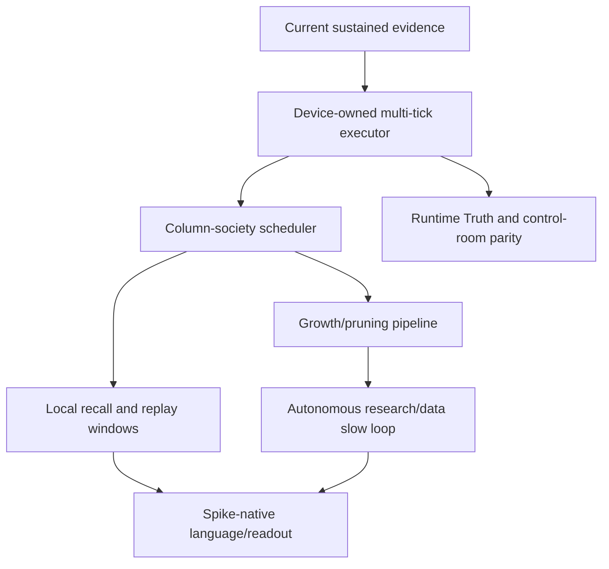

# Next Throughput Goal Map

Use this note to navigate the large-goal queue after the June 2026 velocity work.

## Working Order

1. Start with [Next Throughput Goal Queue](next-throughput-goal-queue.md) for copy-ready `/goal` prompts.
2. Use [Hot-path latency](../benchmarks/hot-path-latency.md) for the retained `4992.049 tokens/sec` sustained evidence and rejected speed paths.
3. Use [marulho.training](../modules/training.md) and [ADR 0006](../../adr/0006-persistent-text-tick-executor.md) for the current executor boundary.
4. Use [Column Runtime](../concepts/column-runtime.md) for the many-column scheduler state.
5. Use [Language from Spikes](../concepts/language-from-spikes.md) for SNN language/readout gates.

## Claim Boundary

This map is navigation only. It does not prove throughput, CUDA placement, language generation, growth, pruning, or autonomy. Use current code, tests, Runtime Truth, and benchmark reports before making capability claims.
