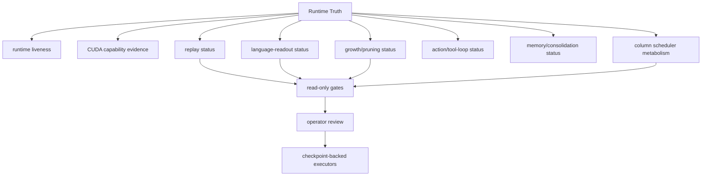

# Runtime Truth Surface Map

Capability and liveness surfaces that must remain evidence summaries rather than execution commands.

## Links

- [Runtime Truth](../concepts/runtime-truth.md)
- [Column Runtime](../concepts/column-runtime.md)
- [Subcortex](../concepts/subcortex.md)
- [Code organization](code-organization-map.md)
- [Capability notes](../capabilities/index.md)
- [Generated graph summary](../generated/graph-summary.md)

## Column Scheduler Boundary

Runtime Truth must keep route input rows, awake output candidates, graph capture
policy, state-transition scope, fallback reason, and `runs_all_columns` truth
separate. The promoted CUDA/text path can truthfully report `10` awake columns
while still exposing route-score input rows that scale with total columns.
`route_vote_scoring` is the explicit training-owned route-cost surface:
`route_input_rows_scored`, `route_output_candidate_count`,
`route_rows_run_all_columns`, and `bounded_route_scoring` must stay separate
from `state_transition_runs_all_columns` and the wake-plan `runs_all_columns`
truth. The route-owner scheduler filter now also reports whether
memory-pressure filtering was enabled from cached pressure evidence, how many
route rows it masked, and why it fell back. Service may project that evidence
but must not construct its own scheduler decision or clear route-cost truth from
awake-count evidence.
