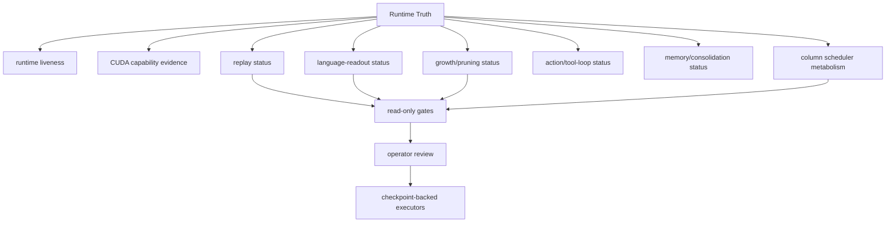

# Runtime Truth Surface Map

Capability and liveness surfaces that must remain evidence summaries rather than execution commands.

## Links

- [Runtime Truth](../concepts/runtime-truth.md)
- [Column Runtime](../concepts/column-runtime.md)
- [Subcortex](../concepts/subcortex.md)
- [Code organization](code-organization-map.md)
- [Capability notes](../capabilities/index.md)
- [Generated graph summary](../generated/graph-summary.md)
