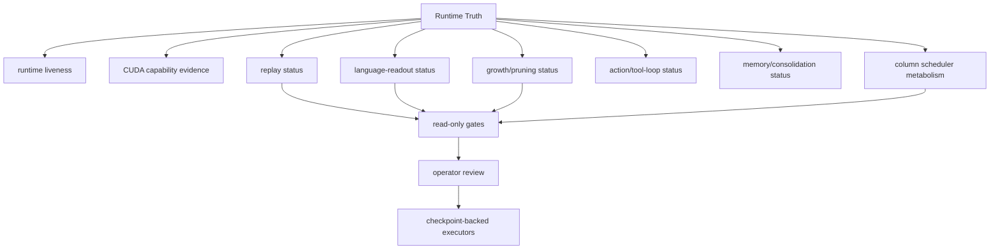

# Runtime Truth Surface Map

Capability and liveness surfaces that must remain evidence summaries rather than execution commands.

## Links

- [Runtime Truth](../concepts/runtime-truth.md)
- [Column Runtime](../concepts/column-runtime.md)
- [Subcortex](../concepts/subcortex.md)
- [Code organization](code-organization-map.md)
- [Capability notes](../capabilities/index.md)
- [Generated graph summary](../generated/graph-summary.md)

## Column Scheduler Boundary

Runtime Truth must keep route input rows, awake output candidates, graph capture
policy, state-transition scope, fallback reason, and `runs_all_columns` truth
separate. The promoted CUDA/text path can truthfully report `10` awake columns
while exposing whether route-score input rows came from the exact seed or the
bounded route-candidate bank plus fixed probe lane.
`route_vote_scoring` is the explicit training-owned route-cost surface:
`route_input_rows_scored`, `route_output_candidate_count`,
`route_rows_run_all_columns`, and `bounded_route_scoring` must stay separate
from `state_transition_runs_all_columns` and the wake-plan `runs_all_columns`
truth. `route_candidate_bank` reports the training-owned bank readiness,
observed fixed `k_routing` bank size, probe rows, score rows, probe cursor,
refresh owner, refresh cadence, exact seed count, refresh count, host/device
refresh counts, graph bypass count, fallback count, checkpoint restore count,
restore reason, and last reason. The bank size
is not a service or config selector; old checkpoint
`route_candidate_bank_size` keys migrate away before the runtime is built. The
exact seed is visible as
`exact_full_cache_score_seed_route_bank`; steady graph/burst ticks report
`indexed_route_bank_vote_device_refresh` with bounded route rows and
`refresh_owner=fused_route_vote_device`. The 2026-06-16 8192-column
probe-lane gate reports `route_input_rows_scored=12/8192`,
`route_output_candidate_count=10`, `state_transition_column_count=10`,
and `state_transition_cached_count=8182`, so Runtime Truth now has a measured
steady-route example where scored rows and awake rows are both bounded after
the explicit exact seed. The corrected 16384- and 32768-column scale gates
report the same `route_input_rows_scored=12` and
`route_output_candidate_count=10` with `state_transition_cached_count=16374`
and `32758`, respectively. The device-refresh 32768 gate reports
`device_refresh_count=131072`, `host_refresh_count=1`,
`route_input_rows_scored=12/32768`, `state_transition_cached_count=32758`,
and zero graph/native/sequence failures. The
2026-06-17 `65536`-column scale gate keeps the same steady truth:
`route_input_rows_scored=12/65536`, `route_output_candidate_count=10`,
`state_transition_cached_count=65526`,
`state_transition_runs_all_columns=false`, `route_rows_run_all_columns=false`,
`bounded_route_scoring=true`, `device_refresh_count=131072`,
`host_refresh_count=1`, and zero graph/native/sequence failures. The
route-owner scheduler filter also reports whether memory-pressure and
usefulness filtering were enabled from cached metabolism evidence, how many
route rows they masked, eligible counts after each gate, thresholds, sources,
and why either gate fell back. Service may project that evidence but must not
construct its own scheduler decision or clear route-cost truth from awake-count
evidence.
Both active service projections now use
`service.column_runtime_projection.build_column_runtime_evidence`, so
`StatusReadModel` and `RuntimeStatusCore` expose the same probe-lane,
wake-plan, cached transition, predictive cached-vote, fallback, and
`runs_all_columns` fields without duplicating scheduler logic.

`structural_review_queue` is the compact continuation surface for future
growth/prune review. Training owns ticket capture from bounded awake/candidate
IDs and checkpoints the queue with the model; Runtime Truth only projects
pending counts, growth/prune counts, evaluated/cached column counts,
update/deferred counts, next gate, operator/checkpoint requirements, and
`runs_all_columns=false`. Service must not derive tickets from status snapshots
or scan columns to decide structural eligibility.
